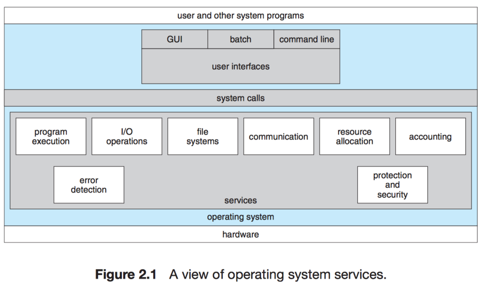
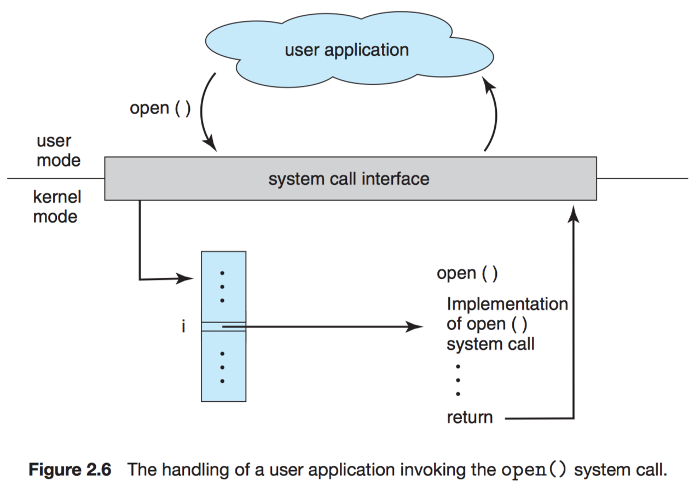

# Chapter 2 Operating-System Structures

Objectives:

- To describe the services an operating system provides to users, processes, and other systems.
- To discuss the various ways of structuring an operating system.
- To explain how operating systems are installed and customized and how they boot.

## 2.1 Operating-System Services

- User interface (UI)
    - command-line interface (CLI)
    - batch interface
    - graphical user interface 

- Program execution. OS load a program into memory $\to$ run that program $\to$ end execution
    - normally
    - abnormally (error)

- I/O operations. A running program may require I/O:
    - file
    - I/O device: recording to a CD or DVD ...

- File-system manipulation.
    - read/write files
    - create/delete them by name
    - search
    - list file (ls)

- Communications.
    - shared memory
    - message passing: packets of information in predefined formats are moved between processes by the operating system

- Error detection
- Resource allocation
- Accounting. users can be billed
- Protection and security

## 2.2 User and Operating-System Interface

### 2.2.1 Command Interpreters

On systems with multiple command interpreters to choose from, the interpreters are known as **shells**.

Two approaches:

1. the command interpreter itself contains the code to execute the command.
    - fast but the interpreter tends to be big! $\to$ painful in revision!
    - e.g. `cd`, `ls`, `del`
2. the command interpreter merely uses the command to identify a file to be loaded into memory and executed $\to$ search exec files
    - parameter passing
    - being slow
    - inconsistent interpretation of parameters
    - e.g. `rm`

### 2.2.2 Graphical User Interfaces

- desktop
- icons
- folder
- mouse
- gestures on the touchscreen

### 2.2.3 Choice of Interface

- shell scripts
    - e.g. `UNIX` and `Linux`.

## 2.3 Systems Calls

System calls provide an interface to the services made available by an operating system.

e.g. writing a simple program to read data from one file and copy them to another file causes a lot of system calls!

- C/C++

Each read and write must return status information regarding various possible error conditions.

- application programming interface (API): it specifies a set of functions
    - Windows API
    - POSIX API
        - UNIX
        - Linux
        - macOS
    - Java API

**libc**: UNIX and Linux for programs written in C

Why prefer API rather than invoking actual system calls?

- protability (expected to run on any system)
- actual system calls can be more difficult to learn

The relationship between an **API**, the **system-call interface**, and the **OS**



The caller need know nothing about how the system call is implemented or what it does during execution. Rather, the caller need only obey the API and understand what the operating system will do as a result of the execution of that system call.

*Make explicit to implicit*.

Three general methods are used to pass parameters to the operating system.

- through registers (Linux and Solaris)
    - block,
    - table, 
    - memory, 
    - and the address of the

- placed or pushed onto the stack $\to$ popped off the stack by the OS

## 2.4 Types of System Calls

### 2.4.1 Process Control

A running program halts either

- normally: `end()`
- abnormally: `abort()`

error $\to$ dump (written to disk, may be examined by a debugger)

More severe errors can be indicated by a higher-level error parameter.

e.g. Standard C Library

### 2.4.2 File Management

### 2.4.3 Device Management

### 2.4.4 Information Maintenance

Many systems provide system calls to `dump()` memory. This provision is useful for debugging. A program trace lists each system call as it is executed. Even microprocessors provide a CPU mode known as single step, in which a trap is executed by the CPU after every instruction. The trap is usually caught by a debugger.

### 2.4.5 Communication

### 2.4.6 Protection

## 2.5 System Programs

## 2.6 Operating-System Design and Implementation

### 2.6.1 Design Goals

### 2.6.2 Mechanisms and Policies

### 2.6.3 Implementation