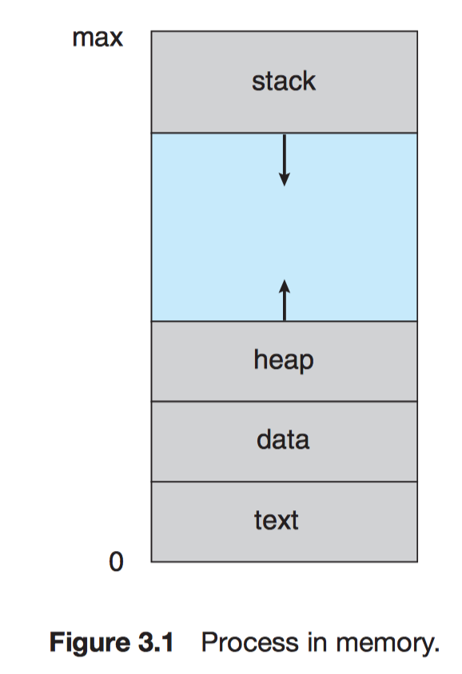
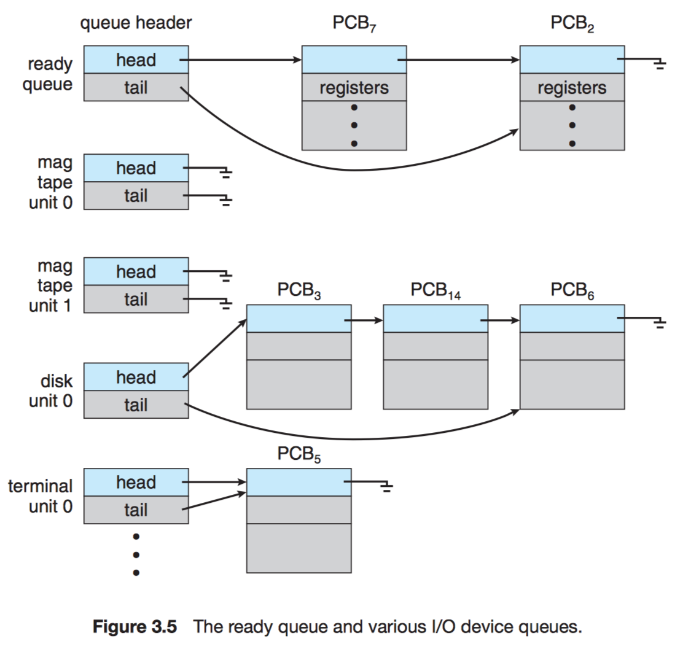
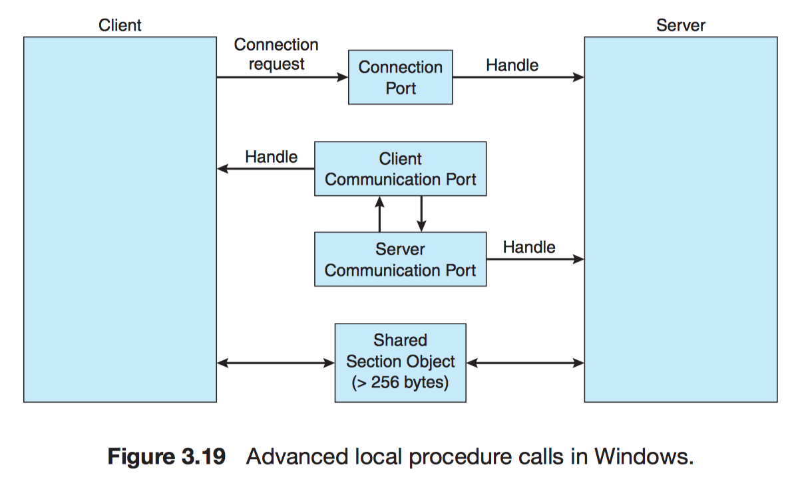
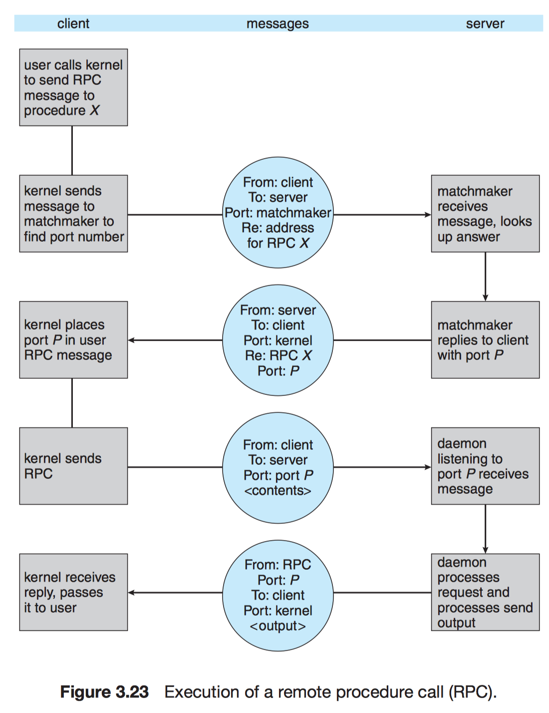
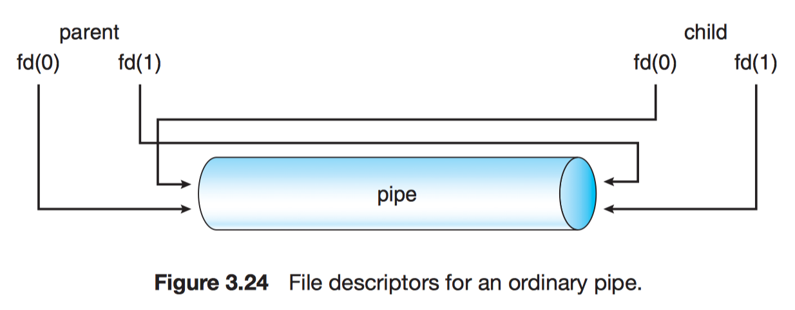

# Chapter 3 Process Concept

## 3.1 Process Concept

!!! note "Process"
    A program in execution, the basis of all computation.

 - Batch system: jobs (= process)
 - Time-shared system: user programs or tasks

### 3.1.1 The process

Process consists

- **text** section: program code
- **data** section: *global variables*
- **heap**: memory
- current activity (*program counter* + *registers*)
- **stack**: *temporary data*:
    - function parameters
    - return addresses
    - local variables

        


| Program | Process |
| :-: | :-: |
| *passive* entity | *active* entity |
| a file containing a list of instructions stored on disk (executable file) | program counter: specifying the next instruction to execute + a set of associated resources |

When

- double-clicking an icon
- prog.exe
- a.out

an executable file is loaded into memory: **program $\to$ process**.

Two different processes: the text section are equivalent, the data, heap and stack vary.

Process can be an execution environment for other code. (**simulation**)

e.g.

```java
java testProgram
```

!!! info ""
    The command `java` runs the JVM as an ordinary process, then executes the Java program `testProgram` in the VM.

### 3.1.2 Process State

- **New**
- **Running**: execute instructions
- **Waiting**: wait some event (I/O, signal)
- **Ready**: wait to be assigned to a processor
- **Terminated**


!!! info "Process and Processor"
    Only **1** process runs on any processor. (Many processes may be **ready** and **waiting**)

### 3.1.3 Process Control Block

- **Process state**
- **Program counter**: address of the next instruction
- **CPU registers**: accumulators, index registers, stack pointers, general-purpose registers, and any condition-code information
- **CPU-scheduling information**
- **Memory-management information**
- **Accounting information**: the amount of CPU and real time used, time limits, account numbers, job or process numbers
- **I/O status information**: the list of I/O devices allocated to the process, a list of open files


## 3.2 Process Scheduling

- **Multiprogramming**: to have some process running at all times $\to$ maximize CPU utilization
- **Time sharing**: switch the CPU among processes
- **Process scheduler**: selects an available process

### 3.2.1 Scheduling Queues

As processes enter the system, they are put into a **job queue**.

- **Job queue**: consists of all processes in the system.
- **Ready queue**: keep *ready* and *waiting* processes.




When a process exit, it is removed from all queues and has its PCB and resources deallocated.

### 3.2.2 Schedulers

Processes are first spooled to a mass-storage device (e.g. disk). Then 

- **Long-term scheduler** (job)

    1. selects processes from this pool
    2. loads them into memory *for* execution

- **Short-term scheduler** (CPU)

    1. selects from among the processes that are ready to execute
    2. allocates CPU to one of them

!!! info "Long-term scheduler"
    - Controls the **degree of multiprogramming** (# processes)
    - Selects a good **process mix** of I/O-bound and CPU-bound

!!! info "Medium-term scheduler"
    Swapping


### 3.2.3 Context Switch

!!! info "When a context switch occurs"
    The kernel saves the context of the old process in its PCB and loads the saved context of the new process scheduled to run.

## 3.3 Operations on Processes

### 3.3.1 Process Creation

!!! note "Process Identifier (pid)"
    An integer number, which provides a unique value for each process in the system, and it can be used as an _index_ to access various attributes of a process within the kernel.

!!! note "init process"
    A process has pid = 1, and serves as the root parent process for all user processes.


When a process creates a child process, that child process may obtain the resources from

- OS
- a subset of parent process

When a process creates a new process

1. The parent continues to execute concurrently with its children.
2. The parent waits until some or all of its children have terminated.

There are also two address-space possibilities for the new process

1. The child process is a duplicate of the parent process (it has the same program and data as the parent).
2. The child process has a new program loaded into it.

!!! note "`fork()`"
    The new process created by `fork()` consists of a copy of the address of parent process.

- Return code

    - Child process: 0
    - Parent process: pid of the child

!!! info "After `fork()` syscall"
    One of the two processes uses the `exec()` syscall to replace the process's memory space with a new program.

Creating a separate process using the UNIX `fork()` system call.

```c
int main() {
  pid_t pid;

  /* fork a child process */
  pid = fork();
  if (pid < 0) {                      /* error occurred */
    fprintf(stderr, "Fork Failed");
    return 1;
  } else if (pid == 0) {              /* child process */
    execlp("/bin/ls", "ls", NULL);    /* a version of the `exec()` */
  } else {                            /* parent process */
    /* parent will wait for the child to complete */
    wait(NULL);
    printf("Child Complete");
  }
  return 0;
}
```


### 3.3.2 Process Termination

A process terminates when it finishes executing its final statement and asks the operating system to delete it by using the `exit()` system call.

!!! info "Terminating process"
    A parent needs to know the identities of its children if it is to terminate them.

A parent can terminate its children by

- The child use too much resources. (The parent have a mechanism to inspect the state of its children)
- The task assigned to the child is no longer required.
- The parent is exiting.

!!! note "Cascading Termination"
    If a process terminates (either normally or abnormally), then all its children must also be terminated.

`exit()` may be called either directly or indirectly (`return`):

```c
exit(1);    /* directly exit with status 1 */
```

!!! note "Process Table Entry (PTE)"
    Contains the process's exit status.

!!! note "Zombie"
    A process terminated, but whose parent hasn't called `wait()`. Once the parent calls `wait()`, the pid of the zombie process and its entry in the PTE are released.

The `init` process periodically invokes `wait()` to collect and release the orphan's pid and PTE.

## 3.4 Interprocess Communication

Processes have two classifications:

- Independent
- Cooperating
    - Information sharing
    - Computation speedup - multicore
    - Modularity
    - Convenience - parallel tasks

Interprocess communication (IPC)

- Shared memory: slower (syscalls are required)
- Message passing: faster (syscalls are required only to establish shared memory regions)


### 3.4.1 Shared-Memory Systems

#### Producer–consumer problem

A **producer** process produces information that is consumed by a **consumer** process.

e.g.

- A compiler produce assembly code that is consumed by an assembler. The assembler, in turn, may produce object modules that are consumed by the loader.
- A server as a producer and a client as a consumer.

We need a buffer which resides in a region of shared memory (producer & consumer), and can be filled by the producer and emptied by the consumer.

- Unbounded buffer
- Bounded buffer (more practical)

Implement the shared `buffer` as a circular array.
```c
#define BUFFER_SIZE 10

typedef struct {
  ...
} item;

item buffer[BUFFER_SIZE];
int in = 0;     /* points to the next free position */
int out = 0;    /* points to the first full position */
```

```c
while (true) {
  /* produce an item in next_produced */

  while (((in + 1) % BUFFER_SIZE) == out)
    ; /* do nothing */

  buffer[in] = next_produced;
  in = (in + 1) % BUFFER_SIZE;
}
```

```c
item next_consumed;

while (true) {
  while (in == out)
    ; /* do nothing */

  next_consumed = buffer[out];
  out = (out + 1) % BUFFER_SIZE;

  /* consume the item in next_consumed */
}
```

### 3.4.2 Message-Passing Systems

Message passing provides a mechanism to allow processes to communicate and to synchronize their actions _without sharing the same address space_.

!!! note "Communication link"
    If processes $P$ and $Q$ want to communicate, they must send messages to and receive messages from each other.

Several implentation of `send()`/`receive()` operations:

- Direct of indirect communication
- Synchronous or asynchronous communication
- Automatic or explicit buffering

#### 3.4.2.1 Naming

- **Direct communication**

    The messages are sent to and received from processes.

    - Symmetry

        - `send(P, message)`
        - `receive(Q, message)`

    - Asymmetry

        - `send(P, message)`
        - `receive(id, message)`

- **Indirect communication**

    The messages are sent to and received from ***mailboxes***, or ***ports***.

    - `send(A, message)` — send a message to mailbox A
    - `receive(A, message)` — receive a message from mailbox A

The process that creates a new mailbox is that mailbox's owner by default.

!!! info ""
    A mailbox can be owned by the OS.

#### 3.4.2.2 Synchronization

Message passing may be either

- Blocking (synchronous)

    - Blocking send (blocked until the message is received)
    - Blocking receive

- Nonblocking (asynchronous)

    - Nonblocking send
    - Nonblocking receive (valid message or a null)

!!! note "Rendezvous"
    When both `send()` and `receive()` are blocking.

#### 3.4.2.3 Buffering

Messages reside in a temporary queue:

- Zero capacity (no buffering)
- Bounded capacity
- Unbounded capacity

## 3.5 Examples of IPC Systems

### 3.5.1 An Example: POSIX Shared Memory

```c
message next_consumed;

while (true) {
  receive(next_consumed);

  /* consume the item in next consumed */
}
```

A process must first create a shared-memory:

```c
shm_fd = shm_open(name, O_CREAT | O_RDRW, 0666);
```

The `ftruncate()` function configure the size of the object in bytes:

```c
ftruncate(shm_fd, 4096);
```

### 3.5.2 An Example: Mach

Even system calls are made by messages. When a task is created, two special mailboxes

- kernel mailbox
- notify mailbox

are also created.

There are three syscalls needed:

- `msg_send()`

    If the mailbox is full:

    1. Wait indefinitely until there is room in the mailbox
    2. Wait at most $n$ milliseconds
    3. Do not wait at all but rather return immediately
    4. Temporarily cache a message (server tasks)

- `msg_receive()`
- `msg_rpc()`: sends a message and waits for exactly one return message from the sender.

!!! note "Remote"
    The RPC (Remote Procedure Call) models a typical subroutine procedure call but can work between systems.

!!! note "`port_allocate()`"
    Creates a new mailbox and allocates space for its queue of messages.

Mach guarantees that multiple messages from the same sender are queued in first-in, first-out (FIFO) order but does not guarantee an absolute ordering

!!! info ""
    One task can either own or receive from a mailbox

!!! note "Mailbox set"
    A collection of mailboxes.

!!! note "port_status()"
    e.g. # of messages in a mailbox.

### 3.5.3 An Example: Windows

Application programs can be considered clients of a subsystem server.

!!! note "Advanced Local Procedure Call (ALPC)"
    It is used for communication between two processes _on the same machine_.

Windows uses two types of ports

- Connection ports
- Communication ports

!!! note "Callback"
    Allows the client and server to accept requests when they would normally be expecting a reply.

When an ALPC channel is created, 1 of 3 message-passing techniques is chosen:

1. Small messages: using the port's message queue.
2. Larger messages: passed through a **section object** (a region of shared memory)
3. Very large messages: calling API to read/write directly into the address space.



## 3.6 Communication in Client–Server Systems

### 3.6.1 Sockets

!!! note "Socket"
    An endpoint for communication. (IP + port#)

A pair of processes communicating over a network employs _a pair_ of sockets—one for each process.

!!! info "Socket behavior"
    The server waits for incoming client requests by listening to a specified port. Once a request is received, the server accepts a connection from the client socket to complete the connection.

Well-known ports: (all ports below 1024 are considered well known)

- 23: telnet
- 21: FTP
- 80: HTTP


Java provides:

- Connection-oriented (TCP) sockets: `Socket`
- Connectionless (UDP) sockets: `DatagramSocket`
- `MulticastSocket`: a subclass of `DatagramSocket`. It allows data to be sent to multiple recipients.

!!! note "Loopback"
    IP address 127.0.0.1.

### 3.6.2 Remote Procedure Calls

The RPC was designed as a way to abstract the procedure-call mechanism for use between systems with network connections.

Each message is addressed to an RPC daemon listening to a port on the remote system, and each contains an identifier specifying the function to execute and the parameters to pass to that function.

!!! info ""
    The semantics of RPCs allows a client to invoke a procedure on a remote host as it would invoke a procedure locally.

!!! note "Stub"
    The RPC system hides the details that allow communication to take place by providing a stub on the client side.

!!! note "Parameter marshalling"
    Packaging the parameters into a form that can be transmitted over a network.

Procedure of RPCs:

1. The client invokes a RPC
2. RPC system
    - calls the appropriate stub (client side)
    - passes the stub the parameters to the RPC
3. Marshals parameter: packaging the parameters into a form that can be transmitted over a network
4. The stub transmits a message to the server using message passing.
5. A stub (server side) 
    - receives this message
    - invokes the procedure on the server
6. (optional) Return values using the same technique

Issues for RPC:

- Data representation
    - External Data Representation (XDR)
        - Parameter marshalling
- Semantics of a call
    - at most once
    - exactly once (ACK)
- Binding of the client and server port
    - Matchmaker (a rendezvous mechanism)



### 3.6.3 Pipes

In implementing a pipe, four issues:

1. Does the pipe allow bidirectional communication, or is communication unidirectional?
2. If two-way communication is allowed, is it half duplex (data can travel only one way at a time) or full duplex (data can travel in both directions at the same time)?
3. Must a relationship (such as parent–child) exist between the communicating processes?
4. Can the pipes communicate over a network, or must the communicating processes reside on the same machine?

#### 3.6.3.1 Ordinary Pipes

```c
pipe(int fd[])
```



Ordinarya pipes on on Windows: **anonymous pipes** (similar to UNIX)

#### 3.6.3.2 Named Pipes

| Ordinary Pipes | Named Pipes |
| : -- : | : -- : |
| unidirectional | bidirectional |
| parent-child required | not required |

!!! info ""
    In UNIX, named pipes = FIFOs. A FIFO is created with the `mkfifo()`.

Pipes in practice:

```bash
 # In this scenario, the ls command serves as the producer, and its output is consumed by the more command.
 $ ls | more
```
