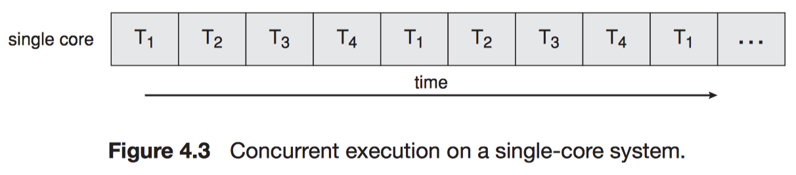
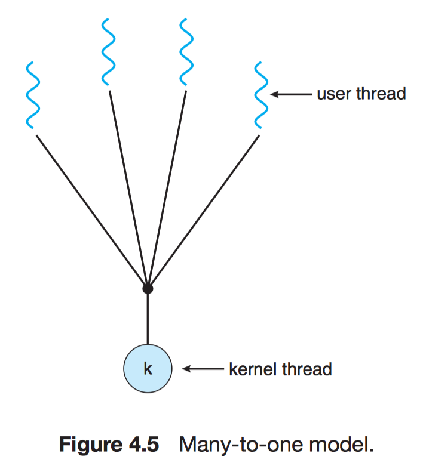
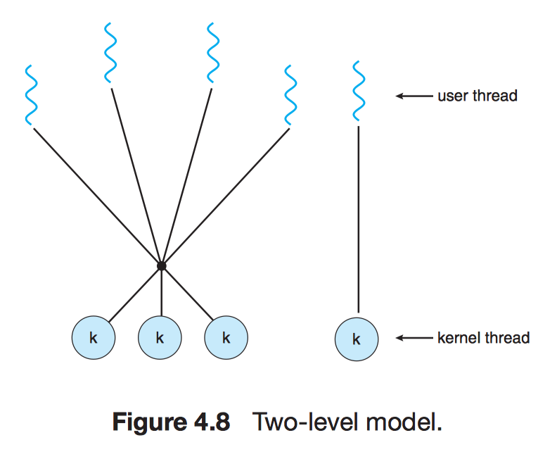
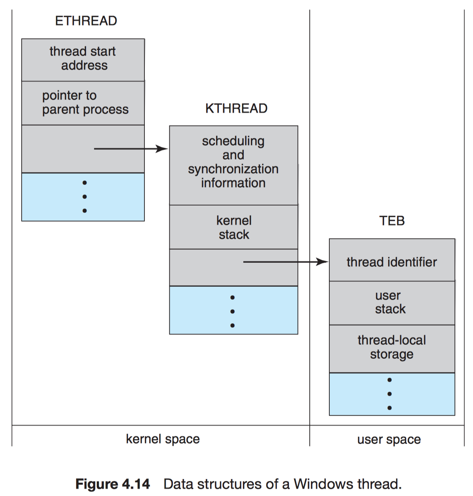

# Chapter 4 Threads

## 4.1 Overview

!!! note "Thread–Lightweight process (LWP)"
    A basit unit of CPU utilization.

A thread shares

- code section
- data section
- OS resources (e.g. open files and signals) 

A thread have its own

- thread ID
- program counter
- register set
- stack


### 4.1.1 Motivation

It is generally more efficient to use one process that contains multiple threads since process creation is time consuming and resource intensive.


### 4.1.2 Benefits

The benefits of multithreaded:

1. **Responsiveness**
2. **Resource sharing**
3. **Economy**
4. **Scalability/Utilization**

## 4.2 Multicore Programming

A more recent, similar trend in system design is to place multiple computing cores on a single chip.

!!! note "Multicore or Multiprocessor systems"
    The cores appear across CPU chips or within CPU chips.

Consider an application with 4 threads.

- With a single core

    

- With multiple cores

    

| Parallelism | Concurrency |
| :--: | :--: |
| Perform more than one task simultaneously. | Allow all the tasks to make progress. |

!!! note "Amdahl's Law"
    If $S$ is the portion cannot be accelerated by $N$ cores (serially).
    
    $$speedup \le \frac{1}{S + \frac{(1 - S)}{N}}$$

### 4.2.1 Programming Challenges

1. Identifying tasks: Dividing Activities
2. Balance (Equal value)
3. Data splitting
4. Data dependency
5. Testing and debugging

### 4.2.2 Types of Parallelism

!!! note "Data parallelism"
    Distribute subsets of the same data across multiple computing cores.

    Each core performs the same operation.

e.g. 

$$\sum_{i = 0}^{N - 1} arr[i] = \sum_{i = 0}^{N / 2 - 1} arr[i] (\text{thread } A) + \sum_{i = N / 2}^{N - 1} arr[i] (\text{thread } B).$$

!!! note "Task parallelism"
    Distribute tasks (threads) across multiple computing cores.
    
    Each thread performs a unique operation.

## 4.3 Multithreading Models

### 4.3.1 Many-to-One Model

- pros:
    - Efficiency

- cons:
    - One blocking syscall blocks all
    - No parallelism for multiple processors

e.g. Green threads (Solaris)



### 4.3.2 One-to-One Model

- pros:
    - One syscall blocks one thread

- cons:
    - Overheads in creating a kernel thread

e.g. Windows NT/2000/XP, Linux, OS/2, Solaris 9


### 4.3.3 Many-to-Many Model

- pros:
    - A combination of parallelism and efficiency

e.g. Solaris 2 & 9, IRIX, HP-UX, Tru64 UNIX




## 4.4 Thread Libraries

- User level
- Kernel level

Three main thread libraries:

- POSIX Pthreads: User or kernel level
- Windows: Kernel level
- Java: Level depending on the thread library on the host system.

Two general strategie for creating threads:

- Asynchronous threading: parent doesn't know children.
- Synchronous threading: parent must wait for all of its children. (***fork-join***)

All of the following examples use synchronous threading.

### 4.4.1 Pthreads

!!! note "Pthreads"
    The POSIX standard (IEEE 1003.1c) defining an API for thread creation and synchronization. This is a ***specification*** for thread behavior, not and ***implementation***.

### 4.4.2 Windows Threads

### 4.4.3 Java Threads

Creating a `Thread` object does not specifically create the new thread. $\to$ `start()` does!

1. It allocates memory and initializes a new thread in the JVM.
2. It calls the `run()` method, making the thread eligible to be run by the JVM.
(Note again that we never call the `run()` method directly. Rather, we call the `start()` method, and it calls the `run()` method on our behalf)

## 4.5 Implicit Threading

### 4.5.1 Thread Pools

The issue of multithreaded server:

- Time to create the thread
- Concurrency

!!! note "Thread pool"
    Create a number of threads at process startup and place them into a pool, where they sit and wait for work.

The benefits of thread pools:

1. Speed
2. Limited # of threads, which is good for OS.
3. Seperating the task of creating tasks allows us to use different strategies.
4. Dynamic or static thread pools

e.g. `QueueUserWorkItem()`, `java.util.concurrent`.

### 4.5.2 OpenMP

!!! note "OpenMP"
    A set of compiler directivese and APIs to support parallel programming in shared memory environment.

    Threads with divided workload are created automatically based on # of cores or a set bound.

!!! note "Parallel regions"
    Blocks of code that may run in parallel.

When OpenMP encounters

```c
    #pragma omp parallel
```

it creates as many threads are there are processing cores in the system.

e.g.

```c
#pragma omp parallel for
for (i = 0; i < N; i++)
    c[i] = a[i] + b[i];
```

### 4.5.3 Grand Central Dispatch

A ma
sOS/iOS combination of extensions to the C.

Like OpenMP, GCD manges most of the details of threading.

```c
    ^{ printf("I am a block."); }
```

GCD schedules blocks for run-time execution by placing them on a **dispatch queue**.

- Serial (FIFO)
- Concurrent (FIFO)
    - low
    - default
    - high

```c
dispatch_queue_t queue = dispatch_get_global_queue(DISPATCH_QUEUE_PRIORITY_DEFAULT, 0);
dispatch_async(queue, ^{ printf("I am a block.") });
```

### 4.5.4 Other Approaches

e.g. Intel's Threading Building Blocks (TBB), `java.util.concurrent`.

## 4.6 Threading Issues

### 4.6.1 The `fork()` and `exec()` System Calls

!!! info "`fork()` issue"

    - Duplicate all threads?
    - Is the new process single-threaded?


!!! info "`exec()` issue"
    If a thread invokese the `exec()`, the program specified in the parameter to `exec()` will replace the entire process—including all threads. Thus if `exec()` is called immediately after forking, then duplicating all threads is unnecessary.

### 4.6.2 Signal Handling

All signals follows:

1. A signal is generated by the occurrence of a particular event.
2. The signal is delivered to a process.
3. Once delivered, the signal must be handled.

Two types of signals:

- Synchronous signal: delivered to the same process that performed the operation causing the signal.
    - illegal memory access
    - division by 0

- Asynchronous signal
    - generated by an external process (e.g. ^C)
    - having a timer expire

A signal may be handled by:

1. A default signal handler
2. A user-defined signal handler

Signal delivering:

1. Deliver the signal to the thread to which the signal applies. (e.g. division by 0)
2. Deliver the signal to every thread in the process. (e.g. ^C)
3. Deliver the signal to certain threads in the process.
4. Assign a specific thread to receive all signals for the process.

Functions/Methods for delivering a signal:

- UNIX:

    ```c
        kill(pid_t pid, int signal)
    ```

- POSIX:

    ```c
        pthread_kill(pthread_t tid, int signal)
    ```

- Windows:

    - Asynchronous Procedure Calls (APCs)

### 4.6.3 Thread Cancellation

!!! note "Target thread"
    A thread that is to be canceled.

Cancellation of a target thread may occur in two different scenarios:

1. **Asynchronous cancellation**. One thread immediately terminates the target thread.
2. **Deferred cancellation**. The target thread periodically checks whether it should terminate, allowing it an opportunity to terminate itself in an orderly fashion.

!!! info ""
    Canceling a thread asynchronously may not free a necessary system-wide resource.

```c
pthread_tid;

/* create the thread */
pthread_create(&tid, 0, worker, NULL);
...
/* cancel the thread */
pthread_cancel(tid);
```

Pthreads supports three cancellation modes:

| Mode | State | Type |
| :--: | :--: | :--: |
| Off | Disabled | – |
| Deferred | Enabled | Deferred |
| Asynchronous | Enabled | Asynchronous |

!!! note "Cancellation point"
    Cancellation occurs only when a thread reaches a cancellation point.

!!! note "Cleanup handler"
    If a cancellation request is found to be pending, this function allows any resources a thread may have acquired to be released before the thread is terminated.

e.g. deferred cancellation:

```c
while (1) {
    /* do some work for awhile */

    /* check if there is a cancellation request */
    pthread_testcancel();
}
```

### 4.6.4 Thread-Local Storage

!!! note "Thread-Local Storage (TLS)"
    Each thread might need its own copy of certain data.

TLS is similar to `static` data.

| TLS | Local variables |
| :--: | :--: |
| visible across function invocations | visible only during a single function invocation |

### 4.6.5 Scheduler Activations

!!! note "Lightweight process (LWP)"
    A virtual processor (kernel threads) on which the application can schedule a user thread to run. (many-to-many or two-level)


!!! note "Scheduler activation"
    The kernel provides an application with a set of virtual processors (LWPs), and the application can schedule user threads onto an available virtual processor.

!!! note "Upcall"
    The kernel must inform an application about certain events.

## 4.7 Operating-System Examples

### 4.7.1 Windows Threads

The general components of a thread include:

- A thread ID uniquely identifying the thread
- A register set representing the status of the processor
- A user stack, employed when the thread is running in user mode
- A kernel stack, employed when the thread is running in kernel mode
- A private storage area used by various run-time libraries and dynamic link libraries (DLLs)

**Context** (register set, stacks, and private sotrage area) of the thread:

- Kernel space
    - ETHREAD—executive thread block:
        - a pointer to the process
        - the address of the routine
        - a pointer to the corresponding KTHREAD

    - KTHREAD—kernel thread block
        - scheduling/synchronization information
        - the kernel stack
        - a pointer to TEB

- User space
    - TEB—thread environment block
        - the thread ID
        - a user-mode stack
        - an array for TLS



### 4.7.2 Linux Threads

`clone()` vs `fork()`

- term ***task***—rather than ***process*** or ***thread***
- Several per-process data structures
    - ***points*** to the same data structures for open files, signal handling, virtual memory, etc.