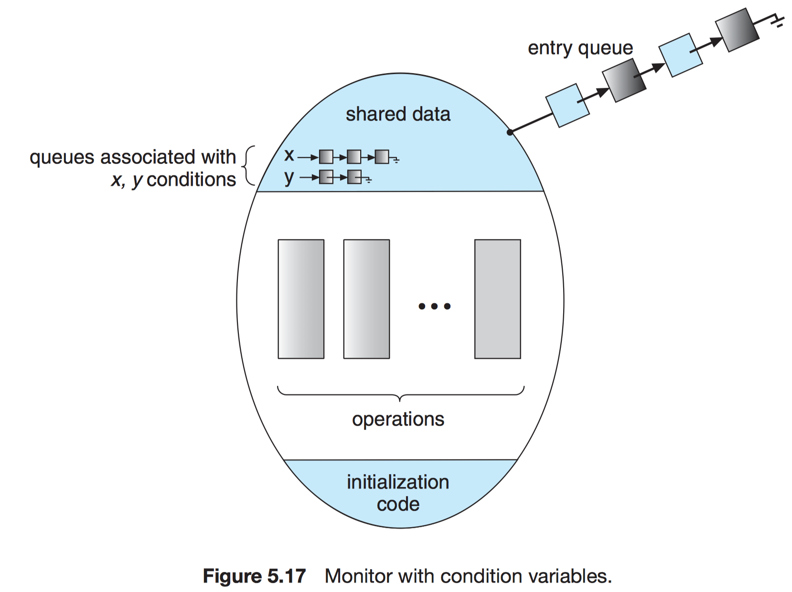

# Chapter 5 Process Synchronization

## 5.1 Background

Recall [producer–consumer problem](./Chap03/#producerconsumer-problem). We modify it as follows:

```c
while (true) {
  /* produce an item in next_produced */

  while (counter == BUFFER_SIZE) ;    // do nothing

  buffer[in] = next_produced;
  in = (in + 1) % BUFFER_SIZE;
  counter++;
}
```

```c
while (true) {
  while (counter == 0) ;      // do nothing

  next_consumed = buffer[out];
  out = (out + 1) % BUFFER_SIZE;
  counter--;

  /* consume the item in next_consumed */
}
```

Suppose `counter == 5` initially. After executing `counter++` in producer or `counter--` in consumer. The value of `counter` may be $4$, $5$, or $6$!

$$
\begin{array}{lllll}
T_0: producer & \text{execute} & register_1 = \text{counter} & \\{register_1 = 5\\} \\\\
T_1: producer & \text{execute} & register_1 = register_1 + 1 & \\{register_1 = 6\\} \\\\
T_2: consumer & \text{execute} & register_2 = \text{counter} & \\{register_2 = 5\\} \\\\
T_3: consumer & \text{execute} & register_2 = register_2 - 1 & \\{register_2 = 4\\} \\\\
T_4: producer & \text{execute} & \text{counter} = register_1 & \\{counter = 6\\} \\\\
T_5: consumer & \text{execute} & \text{counter} = register_2 & \\{counter = 4\\}
\end{array}
$$

!!! note "Race condition"
    Several processes access and manipulate the same data concurrently and the outcome of the execution depends on the *particular order* in which the access takes place.

We need to ensure that only one process at a time can be manipulating the variable `counter`.

## 5.2 The Critical-Section Problem

!!! note "Critical section"
    In which the process may be changing common variables, updating a table, writing a file, and so on.

```c
do {
  /* entry section */
    /* critical section */
  /* exit section */
    /* remainder section */
} while (true);
```

A solution to the critical-section problem must satisfy:

1. **Mutual exclusion**
2. **Progress**. Cannot be postponed indefinitely.
3. **Bounded waiting**

Two general approches are used to handle critical sections:

1. **Preemptive kernels**
2. **Nonpreemptive kernels**

Why anyone favor a preemptive kernel over a nonpreemptive one?

- Responsive.
- More suitable for real-time programming.

## 5.3 Peterson's Solution

Peterson's solution is restricted to two processes that alternate execution between their critical sections and remainder sections. The processes are named $P_i$ and $P_j$.

Shared data items:

```c
int turn;
boolean flag[2];
```

```c
do {
  flag[i] = true;
  turn = j;
  while (flag[j] && turn == j) ;
  /* critical section */

  flag[i] = false;
  /* remainder section */
} while (true);
```

!!! info ""
    If both processes try to enter at the same time, `turn` will be set to both $i$ and $j$ at roughly the same time. *Only one of these assignments will last.*

*Proof*

1. Mutual exclusion is preserved.
2. The progress requirement is satisfied.
3. The bounded-waiting requirement is met.

    Suppose $P_i$ execute $turn = j$ first, then $P_j$ execute $turn = i$. In this assumption, $P_i$ will enter its critical section first and $P_j$ will be stucked in the `while (flag[i] && turn == i)` (remember that here `i` should be thinked as `j` in the code!). After $P_i$ entering exit section, there are two possibilities:

    1. $P_i$ sets `flag[i] = false`, then $P_j$ enters its critical section.
    2. After $P_i$ setting `flag[i] = false`, it immediately sets `flag[i] = true` again, consequently, it'll set `turn = j`, thus $P_j$ still can enter its critical section.

## Bakery Algorithm

- Originally designed for distrubuted systems
- Processes which are ready to enter their critical section must take a number and wait till the number becomes the lowest.

```c
int number[i];          // Pi's number if it is nonzeros
boolean choosing[i];    // Pi is taking a number
```

```c
do {
  choosing[i] = true;         // A process want to enter its critical section
  number[i] = max(number[0], ..., number[n - 1]) + 1;
  choosing[i] = false;        // A process has got its number
  for (int j = 0; j < n; j++) {
    while (choosing[j]) ;
    while (number[j] != 0 && (number[j], j) < (number[i], i)) ;     // If two processes got the same number, then we should compare their indices
  }
  /* critical section */

  number[i] = 0;
  /* remainder section */
} while (true);
```

- An observation: If $P_i$ is in its critical section, and $P_k (k \ne i)$ , then $(number[i], i) < (number[k], k)$.

*Proof*

1. Mutual exclusion: Only the process holds the lowest number can enter the critical section. For each process, when that process doens't get its number, the original process will be stucked in the first while-loop. After that process getting its number, we still need to compare their $numbers$ and $indices$.
2. Progress requirement: The processes won't be forever postponed.
3. Bounded-waiting: Assume that a process holds the biggest number, it should wait other processes in the second while-loop. But after all other process entering their exit section and again entering their entry section, they'll get a bigger number, thus the process won't wait forever.

## 5.4 Synchronization Hardware

Disaple interrupt $\to$ No preemption:

- Infeasible in multiprocessor environment.
- Potential impacts on interrupt-driven system clocks.

!!! info "Atomic"
    Modern computer allow us either to test and modify the content of a word or to swap the contents of two words **atomically**—that is, as one uninterruptible.

Although following algorithms satisfy the mutual-exclusion requirement, they don't satisfy the bounded-waiting requirement.

```c
boolean test_and_set(boolean *target) {
  boolean rv = *target;
  *target = true;

  return rv;
}
```

```c
do {
  while (test_and_set(&lock)) ;
  /* critical section */

  lock = false;
  /* remainder section */
} while (true);
```

The first process executing `while (test_and_set(&lock))` will set the address value of `lock` to `true` and get the return value `rv = false`, thus it won't be stucked in the while-loop and it can enter its critical section.

1. Mutual exclusion: OK
2. Progress requirement: OK
3. Bounded-waiting: FAIL

    Assume there is only one CPU, after $P_i$ entering its critical section, $P_j$ will be stucked in the while-loop. After $P_i$ exiting its critical section, there are two possibilities:

    1. $P_i$ sets `lock = false`, the CPU context switch to $P_j$, thus $P_j$ can enters its critical section.
    2. After $P_i$ setting `lock = false`, the CPU still executes the code of $P_i$, thus $P_i$ enters its critical section again, so $P_j$ may wait forever.

```c
void swap(boolean *a, boolean *b) {
  boolean temp = *a;
  *a = *b;
  *b = temp;
}
```

```c
do {
  key = true;
  while (key == true)
    swap(&lock, &key);
  /* critical section */

  lock = false;
  /* remainder section */
} while (true);
```

1. Mutual exclusion: OK
2. Progress requirement: OK
3. Bounded-waiting: FAIL (the reason is like above)

```c
int compare_and_swap(int *value, int expected, int new_value) {
  int temp = *value;

  if (*value == expected)
      *value = new_value;

  return temp;
}
```

```c
do {
  while (compare_and_swap(&lock, 0, 1) != 0) ;
  /* critical section */

  lock = 0;
  /* remainder section */
} while (true);
```

Following algorithms satisfies all the critical-section requirements.

```c
boolean waiting[n];
boolean lock;
```

```c
do {
  waiting[i] = true;
  key = true;
  while (waiting[i] && key)
    key = test_and_set(&lock);
  waiting[i] = false;
  /* critical section */

  j = (i + 1) % n;                    // Assign its next process
  while ((j != i) && !waiting[j])     // Find a following process who is waiting
    j = (j + 1) % n;

  if (j == i)                         // If no process is waiting
    lock = false;
  else
    waiting[j] = false;             // Thus line 4 will be false and Pj won't be stucked anymore
  /* remainder section */
} while (true);
```

```c
boolean test_and_set(boolean *target) {
  boolean rv = *target;
  *target = true;

  return rv;
}
```

Assume `lock` is initialized to `false`.

1. Mutual exclusion: If many processes set their `waiting[i] = true`, after the first process execute `key = test_and_set(&lock)`, `key` will be set to `false` and `lock` will be set to `true`. Therefore, other processes will be stucked in `while (waiting[i] && key)` since their `key` will be set to `true` after `test_and_set(&lock)` (`lock` is now `true`).
2. Progress requirement: Only the process first run `test_and_set` can enter its critical section.
3. Bounded-waiting: Wait at most $n - 1$ times.

## Mutex Locks

A high-level software solution to provide protect critical sections with mutual exclusion.

- Atomic execution of `acquire()` and `release()`.
- Spinlock:
    - pros: No context switch for multiprocessor systems.
    - cons: Busy waiting.

```c
acquire() {
  while (!available) ;        // busy wait
  available = false;
}
```

```c
release() {
  available = true;
}
```

```c
do {
  // acquire lock
    /* critical section */
  // release lock
    /* remainder section */
} while (true);
```

!!! note "Spinlock"
    The process "spins" while waiting for the lock to become available.

## 5.6 Semaphores

A high-level solution for more complex problems.

- A variable `S` only accessible by two atomic operations
- Spinlock

```c
wait(S) {             /* P */
  while (S <= 0) ;    // busy wait
  S--;
}
```

```c
signal(S) {           /* V */
  S++;
}
```

### 5.6.1 Semaphore Usage

- Critical sections:

    ```c
    do {
      wait(mutex);
      /* critical section */
      signal(mutex);
      /* remainder section */
    } while (true);
    ```

- Precedence enforcement:
    - $P_1$:

        ```c
        S1;
        signal(synch);
        ```

    - $P_2$:

        ```c
        wait(synch);
        S2;
        ```

### 5.6.2 Semaphore Implementation

It's not good for single CPU.
Even if it's implemented in a multi-CPU environment, the locks should be held for a short time.

We can implement the Semaphores with block waiting:

```c
typedef struct {
  int value;
  struct process *list;
} semaphore;
```

```c
wait(semaphore *S) {
  S->value--;
  if (S->value < 0) {
    add this process to S->list;
    block();
  }
}
```

```c
signal(semaphore *S) {
  S->value++;
  if (S->value <= 0) {
    remove a process P from S->list;
    wakeup(P);
  }
}
```

!!! info ""
    $|S.value|$ = # of waiting processes if $S.value < 0$.

Bounded-waiting can be satisfied by FIFO queue but may be unsatisfied by priority queue.

### 5.6.3 Deadlocks and Starvation

!!! note "Deadlock"
    A set of processes is in a deadlock state when every process in the set is waiting for an event that can be caused only by another process in the set.

$$
\begin{array}{cc}
P_0 & P_1 \\\\
wait(S); & wait(Q); \\\\
wait(Q); & wait(S); \\\\
\vdots & \vdots \\\\
signal(S); & signal(Q); \\\\
signal(Q); & signal(S); \\\\
\end{array}
$$

Deadlock may happen (assume $S = 1$ and $Q = 1$:

1. $P_0$ calls $wait(S)$
2. $P_1$ calls $wait(Q)$
3. $P_1$ calls $wait(S)$
4. $P_0$ calls $wait(Q)$

!!! note "Starvation (Indefinite blocking)"
    A situation in which processes wait indefinitely within the semaphore.

    e.g. priority queue, stack (LIFO).

### 5.6.4 Priority Inversion

!!! note "Priority Inversion"
    A higher-priority task is blocked by a lower-priority task due to some resource access conflict.

### Binary Semaphore

We can implement counting semaphores by binary semaphores. ($S_1 = 1$, $S_2 = 0$ and $S_3 = 1$)

```c
WAIT(S) {
  wait(S3);   // protect the whole program
  wait(S1);   // protect C
  C--;
  if (C < 0) {
    signal(S1);
    wait(S2);
  } else signal(S1);
  signal(S3);
}
```

```c
SIGNAL(S) {
  wait(S1);
  C++;
  if (C <= 0)
    signal(S2);     // wake up
  signal(S1);
}
```

- Is `wait(S3)` necessary?
- Can we change the order of `signal(S1)` and `wait(S2)`?
- There are lots of implementation details.

## 5.7 Classic Problems of Synchronization

### 5.7.1 The Bounded-Buffer Problem

```c
int n;
semaphore mutex = 1;
semaphore empty = n;
semaphore full = 0;
```

- Producer:

    ```c
    do {
      /* produce an item in next_produced */

      wait(empty);
      wait(mutex);

      /* add next_produced to the buffer */

      signal(mutex);
      signal(full);
    } while (true);
    ```

- Consumer:

    ```c
    do {
      wait(full);
      wait(mutex);

      /* remove an item from buffer to next_consumed */

      signal(mutex);
      signal(empty);

      /* consume the item in next_consumed */
    } while (true);
    ```

### 5.7.2 The Readers–Writers Problem

- The basic assumption:
    - Readers: shared locks
    - Writers: exclusive locks

- The first reader-writers problem
    - No readers will be kept waiting unless a writer has already obtained permission to use the shared object $\to$ potential hazard to writers!

- The second reader-writers problem
    - One a writer is ready, it performs its write asap $\to$ potential hazard to readers.

```c
semaphore rw_mutex = 1;
semaphore mutex = 1;
int read_count = 0;
```

```c
do {
  wait(rw_mutex);

  /* writing is performed */

  signal(rw_mutex);
} while (true);
```

```c
do {
  wait(mutex);        // protect read_count
  read_count++;
  if (read_count == 1)
    wait(rw_mutex);
  signal(mutex);

  /* reading is performed */

  wait(mutex);        // protect read_count
  read_count--;
  if (read_count == 0)
    signal(rw_mutex);
  signal(mutex);
} while (true);
```

### 5.7.3 The Dining-Philosophers Problem

- Each philosopher must pick up one chopstick beside him/her at a time.
- When two chopsticks are picked up, the philosopher can eat.

```c
semaphore chopstick[5];
```

```c
do {
  wait(chopstick[i]);
  wait(chopstick[(i + 1) % 5]);

  /* eat for awhile */

  signal(chopstick[i]);
  signal(chopstick[(i + 1) % 5]);

  /* think for awhile */
} while (true);
```

## Critical Regions

- Region $v$ when $C$ (condition) do $S$ (statements)
    - Variable $v$ — shared among processes and only accessible in the region.

```c
struct buffer {
  item pool[n];
  int count, in, out;
};
```

- Producer:

    ```c
    region buffer when
    (count < n) {
      pool[in] = next_produced;
      in = (in + 1) % n;
      count++;
    }
    ```

- Consumer:

    ```c
    region buffer when
    (count > 0) {
      next_consumed = pool[out];
      out = (out + 1) % n;
      count--;
    }
    ```

## 5.8 Monitors

```c
monitor monitor name {
    /* shared variable declarations */

    function P1 ( . . . ) {
      . . .
    }

    function P2 ( . . . ) {
      . . .
    }

      .
      .
      .
    function Pn ( . . . ) {
      . . .
    }

    initialization_code ( . . . ) {
      . . .
    }
}
```

### 5.8.1 Monitor Usage

An abstract data type—or ADT—encapsulates data with a set of functions to operate on that data that are independent of any specific implementation of the ADT.

The monitor construct ensures that only one process at a time is active within the monitor.

A programmer who needs to write a tailor-made synchronization scheme can define one or more variables of type $condition$:

```c
condition x, y;
```

The only operations that can be invoked on a condition variable are `wait()` and `signal()`. The operation

```c
x.wait();
```

means that the process invoking this operation is suspended until another process invokes

```c
x.signal();
```

!!! info "Condition variables (of a monitor) vs. signal operation (of binary semaphore)"
    The `x.signal()` operation resumes exactly one suspended process. If no process is suspended, then the `signal()` operation has no effect; that is, the state of `x` is the same as if the operation had never been executed. Contrast this operation with the `signal()` operation associated with semaphores, which always affects the state of the semaphore.

Suppose that, when the `x.signal()` operation is invoked by a process `P`, there exists a suspended process `Q` associated with condition `x`. Clearly, if the suspended process `Q` is allowed to resume its execution, the signaling process `P` must wait. Two possibilities exist:

1. **Signal and wait**: `P` either waits until `Q` leaves the monitor or waits for another condition.

1. **Signal and continue**: `Q` either waits until `P` leaves the monitor or waits for another condition.



### 5.8.2 Dining-Philosophers Solution Using Monitors

```c
enum {THINKING, HUNGRY, EATING} state[5];
condition self[5];
```

```c
monitor DiningPhilosophers {
  enum { THINKING, HUNGRY, EATING } state[5];
  condition self[5];

  void pickup(int i) {
    state[i] = HUNGRY;
    test(i);
    if (state[i] != EATING)
      self[i].wait();
  }

  void putdown(int i) {
    state[i] = THINKING;
    test((i + 4) % 5);      // help your right-hand side to run test
    test((i + 1) % 5);      // help your left-hand side to run test
  }

  void test(int i ) {
    if ((state[(i + 4) % 5] != EATING) &&       // right-hand side
        (state[i] == HUNGRY) &&
        (state[(i + 1) % 5] != EATING)) {       // left-hand side
      state[i] = EATING;
      self[i].signal();
    }
  }

  initialization_code() {
    for (int i = 0; i < 5; i++)
      state[i] = THINKING;
  }
}
```

- $P_i$:

    ```c
    DiningPhilosophers.pickup(i);

    /* eat */

    DiningPhilosophers.putdown(i);
    ```

No deadlock, but starvation could occur!

### 5.8.3 Implementing a Monitor Using Semaphores

- Semaphores
    - `mutex`: to protect the monitor
    - `next`: being initialized to zero, on which processes may suspend themselves
        - `next_count`

Each external function `F` is replaced by

```c
wait(mutex);

/* body of F */

if (next_count > 0)
  signal(next);
else
  signal(mutex);
```

For each condition `x`, we introduce a semaphore `x_sem` and an integer variable `x_count`, both initialized to $0$.

- `x.wait()`

    ```c
    x_count++;
    if (next_count > 0)
      signal(next);
    else
      signal(mutex);
    wait(x_sem);
    x_count--;
    ```

- `x.signal()`

    ```c
    if (x_count > 0) {      /* If there's somebody being waiting */
      next_count++;
      signal(x_sem);
      wait(next);
      next_count--;
    }
    ```

### 5.8.4 Resuming Processes within a Monitor

- **conditional-wait**:

    ```c
    x.wait(c);
    ```

    where $c$ is a **priority number**. When `x.signal()` is executed, the process with the smallest priority number is resumed next.


Consider the `ResourceAllocator` monitor, which controls the allocation of a single resource among competing processes.

```c
monitor ResourceAllocator {
  boolean busy;
  condition x;

  void acquire(int time) {
    if (busy)
      x.wait(time);
    busy = true;
  }

  void release() {
    busy = false;
    x.signal();
  }

  initialization_code() {
    busy = false;
  }
}
```

- A process that needs to access the resource in question must observe the following sequence:

    ```c
    R.acquire(t);

    /* access the resource */

    R.release();
    ```

The monitor concept cannot guarantee that the preceding access sequence will be observed. In particular, the following problems can occur:

- A process might access a resource without first gaining access permission to the resource.

- A process might never release a resource once it has been granted access to the resource.

- A process might attempt to release a resource that it never requested.

- A process might request the same resource twice (without first releasing the resource).

## 5.9 Synchronization Examples

### 5.9.1 Synchronization in Windows

- General Mechanism
    - Spin-locking for short code segments in a multiprocessor platform.
    - Interrupt disabling when the kernel accesses global variables in a uniprocessor platform.

- Dispatcher Object
    - State: signaled or non-signaled
    - Mutex: select one process from its waiting queue to the ready queue.
        - Critical-section object — user-mode mutex
    - Events: like condition variables
    - Timers: select all waiting processes

### 5.9.2 Synchronization in Linux

Preemptive kernel after version 2.6.

- Atomic integer

    ```c
    atomic_t counter;
    ...
    atomic_set(&counter, 5);
    atomic_add(10, &counter);
    ```

- Semaphores for long code segments. Mutex locks for the kernel code.
- Sping-locking for short code segments in a multiprocessor platform.
- Preeption disabling and enabling in a uniprocessor platform.
    - `preempt_disable()` and `preempt_enable()`
    - `preempt_count` for each task in the system

### 5.9.3 Synchronization in Solaris

- Semaphores and condition variables
- Adaptive mutex
    - spin-locking if the lock-holding thread is running; otherwise, blocking is used
- Readers-writers locks
    - expensive in implementations
- Turnstile
    - A queue structure containing threads blocked on a lock
    - Priotity inversion $\to$ priority inheritance protocol for kernel threads

### 5.9.4 Pthreads Synchronization

- General Mechanism
    - Mutex locks: mutual exclusion
    - condition variables: monitor
    - Read-write locks

## 5.10 Alternative Approaches

### 5.10.1 Transactional Memory

!!! note "Memory transaction"
    A sequence of memory read-write operations that are atomic.

Committed or being roleld back:

```c
void update() {
  atomic {
    /* modify shared data */
  }
}
```

- Advantages:
    - No deadlock
    - Identification of potentially concurrently executing statements in atomic blocks
- Implementations:
    - Software transaction memory
        - Code is inserted by the *compiler*.
    - Hardware transactional memory
        - *Hardware* cache hierarchies and cache coherency protocols are used.

### 5.10.2 OpenMP

- A set of compiler directives and an API
    - The critical-section compiler directive behaves like a binary semaphore or mutex.

```c
void update() {
  #pragma omp critical {
    counter += value;
  }
}
```

- pros: easy to use
- cons: identification of protected code and potentials of deadlocks

### 5.10.3 Functional Programming Languages