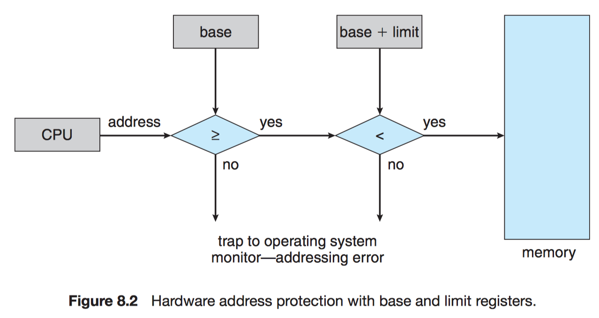
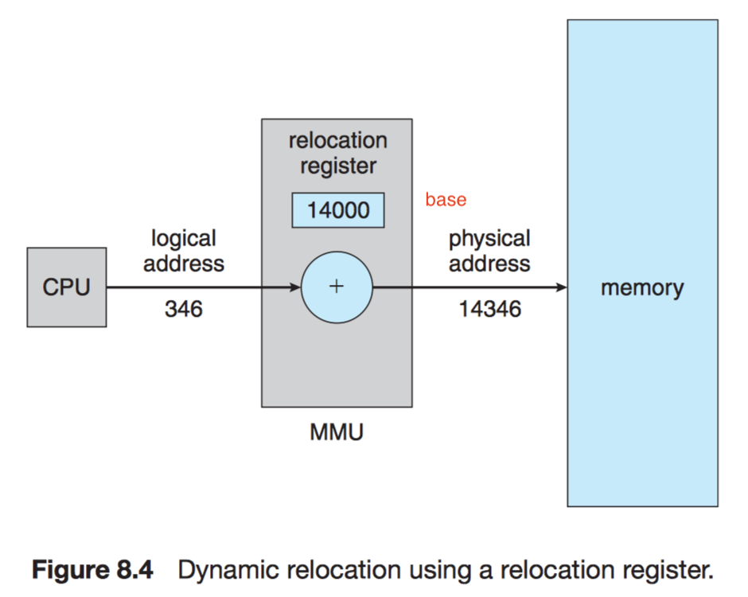
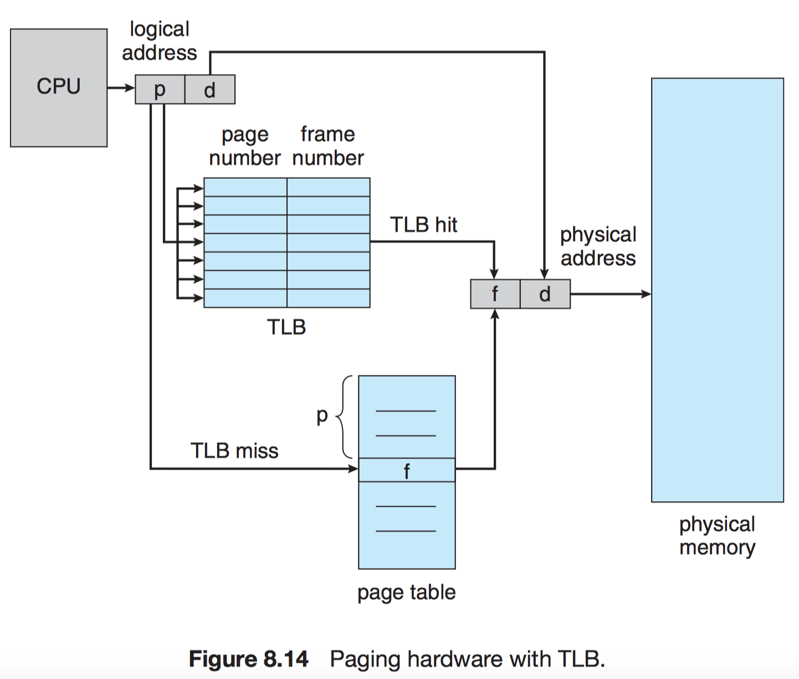
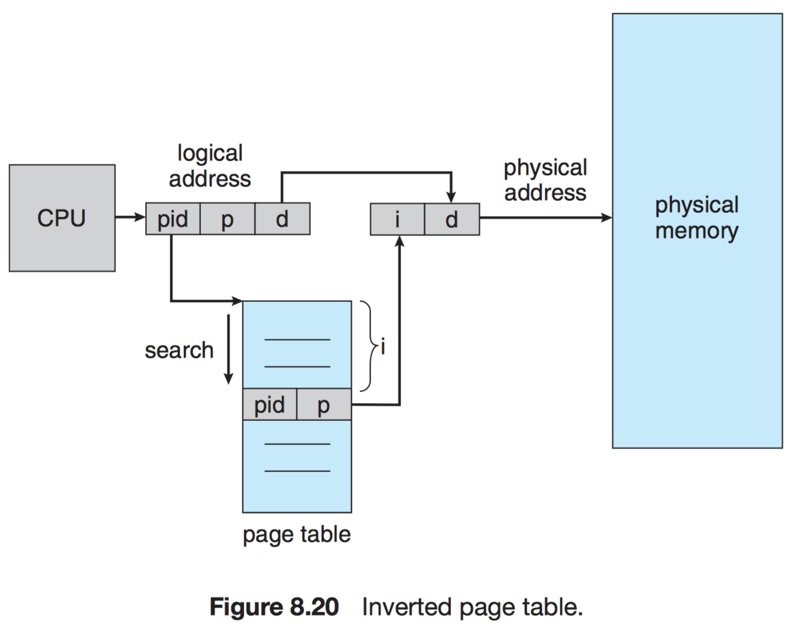
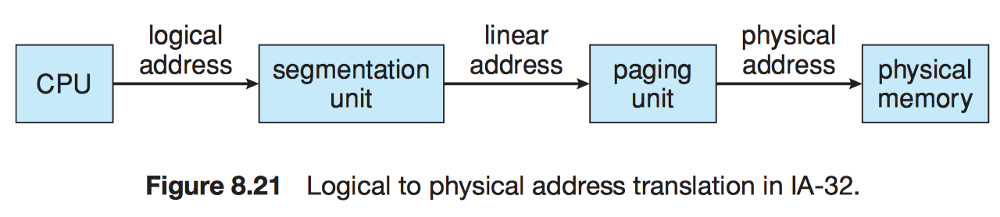
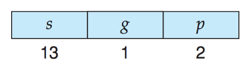

# Chapter 8 Main Memory

## 8.1 Background

The CPU fetches instructions from memory according to the value of the program counter.

Memory Management Motivation:

- Keep several processes in memory to improve a system's performance

### 8.1.1 Basic Hardware

!!! info ""
    **Main memory** and the **registers** built into the processor itself are the only general-purpose storage that the CPU can access directly.

We need to make sure that each process has a separate memory space.

We can provide this protection by using two registers, usually **a  base** and **a limit**.

### 8.1.2 Address Binding

The binding of instructions and data to memory addresses can be done at any step along the way:

- **Compile time**: absolute code.
- **Load time**: relocatable code.
- **Execution time**

A major portion of this chapter is devoted to showing how these various bindings can be implemented effectively in a computer system and to discussing appropriate hardware support.

### 8.1.3 Logical Versus Physical Address Space

!!! note "Logical address"
    An address generated by the CPU.

!!! note "Physical address"
    An address seen by the memory unit and loaded into the memory-address register.

- Generating identical logical and physical addresses:
    - Compile-time address-binding
    - Load-time address-binding

- Generating different logical and physical addresses:
    - Execution-time address-binding
        - logical address $\to$ **virtual address**

!!! note "Logical address space"
    The set of all logical addresses generated by a program.

!!! note "Physical address space"
    The set of all physical addresses corresponding to these logical addresses.

!!! note "Memory-management unit (MMU)"
    Run-time map from virtual to physical addresses.

The user program never sees the real physical addresses and deals with logical addresses.

The memory-mapping hardware converts logical addresses into physical addresses

### 8.1.4 Dynamic Loading

!!! note "Dynamic loading"
    A routine is not loaded until it is called.

### 8.1.5 Dynamic Linking and Shared Libraries

!!! note "Dynamically linked libraries"
    System libraries that are linked to user programs when the programs are run.

!!! note "Static linking"
    System libraries are treated like any other object module and are combined by the loader into the binary program image.

!!! note "Dynamic linking"
    Linking is postponed until execution time. e.g. language subroutine libraries.

With dynamic linking, a **stub** is included in the image for each library-routine reference.

!!! note "Stub"
    A small piece of code that indicates how to locate the appropriate memory-resident library routine or how to load the library if the routine is not already present.

!!! note "Shared libraries"
    Only programs that are compiled with the new library version are affected by any incompatible changes incorporated in it. Other programs linked before the new library was installed will continue using the older library.

## 8.2 Swapping

A process must be in memory to be executed. A process, however, can be swapped temporarily out of memory to a **backing store** and then brought back into memory for continued execution.

### 8.2.1 Standard Swapping

The context-switch time in such a swapping system is fairly high.

Let's assume that the user process is 100 MB in size and the backing store is a standard hard disk with a transfer rate of 50 MB per second. The actual transfer of the 100-MB process to or from main memory takes

$$\frac{100\text{MB}}{50\text{MB}/s} = 2s.$$

### 8.2.2 Swapping on Mobile Systems

Mobile systems do not support swapping in general but might have paging (iOS and Android)

## 8.3 Contiguous Memory Allocation

The memory is usually divided into two partitions:

- one for the resident operating system and
- one for the user processes.

!!! note "Contiguous memory allocation"
    Each process is contained in a single section of memory that is contiguous to the section containing the next process.

### 8.3.1 Memory Protection

- The **relocation register** contains the value of the smallest *physical address*.
- The **limit register** contains the range of *logical addresses*.

### 8.3.2 Memory Allocation

One of the simplest methods for allocating memory is to divide memory into several fixed-sized **partitions**.

Thus, the degree of multiprogramming is bound by the number of partitions.

- In this **multiple-partition method**, when a partition is free, a process is selected from the input queue and is loaded into the free partition.

- In the **variable-partition** scheme, the operating system keeps a table indicating which parts of memory are available and which are occupied.

**Dynamic storage-allocation problem** concerns how to satisfy a request of size $n$ from a list of free holes. There are many solutions to this problem:

- **First fit**
- **Best fit**
- **Worst fit**

Simulations have shown that both first fit and best fit are better than worst fit in terms of decreasing time and storage utilization. Neither first fit nor best fit is clearly better than the other in terms of storage utilization, but first fit is generally faster.

### 8.3.3 Fragmentation

Both the first-fit and best-fit strategies for memory allocation suffer from **external fragmentation**.

!!! note "External fragmentation"
    There is enough total memory space to satisfy a request but the available spaces are not contiguous

!!! note "50-percent rule"
    Even with some optimization, given $N$ allocated blocks, another $0.5 N$ blocks will be lost to fragmentation. That is, one-third of memory may be unusable!

!!! note "Internal fragmentation"
    The memory allocated to a process may be slightly larger than the requested memory. The difference between these two numbers is internal fragmentation.

!!! note "Compaction"
    The goal is to shuffle the memory contents so as to place all free memory together in one large block.

Compaction is possible only if

- relocation is dynamic and
- is done at execution time.

Another possible solution to the external-fragmentation problem is to permit the logical address space of the processes to be noncontiguous, thus allowing a process to be allocated physical memory wherever such memory is available:

- Segmentation
- Paging

## 8.4 Segmentation

!!! note "Segmentation"
    A memory-management scheme that supports this programmer view of memory.

### 8.4.1 Basic Method

segments are numbered and are referred to by a segment number, rather than by a segment name. Thus, a logical address consists of a *two tuple*:

<*segment-number, offset*>

### 8.4.2 Segmentation Hardware

A logical address consists of two parts:

- a segment number: $s$
- an offset into that segment: $d$

**Segment table** consists of

- a segment base: contains the starting physical address where the segment resides in memory.
- a segment limit: specifies the length of the segment.

## 8.5 Paging

Paging avoids external fragmentation and the need for compaction, whereas segmentation does not.

- breaking physical memory into fixed-sized blocks called **frames**
- breaking logical memory into blocks of the same size called **pages**

Every address generated by the CPU is divided into two parts:

- a **page number (p)**
- a **page offset (d)**

If the size of the logical address space is $2^m$, and a page size is $2^n$ bytes. The logical address is as follows:

On my MacBook Pro (15-inch, 2017), I obtain the page size of 4096 bytes = 4 KB.

In the worst case, a process would need $n$ pages plus $1$ byte. It would be allocated $n + 1$ frames, resulting in internal fragmentation of almost an entire frame.

!!! note "Frame table"
    It has one entry for each physical page frame, indicating whether the latter is free or allocated and, if it is allocated, to which page of which process or processes.

### 8.5.2 Hardware Support

- The page table is implemented as a set of dedicated **registers**.
    - pros: fast
    - cons: entries could be small

- The page table is kept in main memory, and a **page-table base register** (**PTBR**) points to the page table. Changing page tables requires changing only this one register, substantially reducing context-switch time.
    - pros: entries could be large
    - cons: slow (the time required to access a user memory location)
        - With this scheme, ***two*** memory accesses are needed to access a byte (one for the page-table entry, one for the byte)

!!! note "Translation look-aside buffer (TLB)"
    The TLB is associative, high-speed memory. Each entry in the TLB consists of two parts:

    - a key (or tag)
    - a value

The TLB contains only a few of the page-table entries (typically between 32 and 1024 entries). When a logical address is generated by the CPU, its page number is presented to the TLB. If the page number is found, its frame number is immediately available and is used to access memory. As just mentioned, *these steps are executed as part of the instruction pipeline within the CPU, adding no performance penalty* compared with a system that does not implement paging.

!!! note "TLB miss"
    The page number is not in the TLB.

!!! info "TLB replacement policies"
    If the TLB is already full of entries, an existing entry must be selected for replacement. Replacement policies range from **least recently used (LRU)** through round-robin to random.

!!! info "Wire down"
    Some TLBs allow certain entries to be **wired down**, meaning that they cannot be removed from the TLB. Typically, TLB entries for key kernel code are wired down.

Some TLBs store **address-space identifiers** (**ASIDs**) in each TLB entry.

!!! note "ASID"
    An ASID uniquely identifies each process and is used to provide address-space protection for that process.

!!! note "Hit ratio"
    The percentage of times that the page number of interest is found in the TLB.

### 8.5.3 Protection

We can create hardware to provide read-only, read-write, or execute-only protection.

!!! note "Valid–invalid bit"
    When this bit is set to valid, the associated page is in the process's logical address space and is thus a legal page.

!!! note "Page-table length register (PTLR)"
    To indicate the size of the page table.

### 8.5.4 Shared Pages

To be sharable, the code must be reentrant. The read-only nature of shared code should not be left to the correctness of the code; the operating system should enforce this property.

## 8.6 Structure of the Page Table

### 8.6.1 Hierarchical Paging

Hierarchical paging is also known as **forward-mapped page table**.

The VAX minicomputer from Digital Equipment Corporation (DEC):

### 8.6.2 Hashed Page Tables

!!! note "Clustered page tables"
    Each entry in the hash table refers to several pages (such as 16) rather than a single page, which are particularly useful for  address spaces.

### 8.6.3 Inverted Page Tables

!!! note "Inverted page table"
    An inverted page table has one entry for each real page (or frame) of memory. Each entry consists of the virtual address of the page stored in that real memory location, with information about the process that owns the page.

For the ***IBM RT***, each virtual address in the system consists of a triple:

<*process-id, page-number, offset*>

!!! info "Shared memory & Inverted page tables"
    Shared memory cannot be used with inverted page tables; because there is only one virtual page entry for every physical page, one physical page cannot have two (or more) shared virtual addresses.

### 8.6.4 Oracle SPARC Solaris

!!! note "TLB walk"
    - If a match is found in the TSB, the CPU copies the TSB entry into the TLB, and the memory translation completes.
    - If no match is found in the TSB, the kernel is interrupted to search the hash table.

## 8.7 Example: Intel 32 and 64-bit Architectures

### 8.7.1 IA-32 Architecture

segmentation unit + paging unit = memory-management unit (MMU)

#### 8.7.1.1 IA-32 Segmentation

The logical address is a pair (selector, offset), where the selector is a 16-bit number:

- $s$: the segment number
- $g$: GDT or LDT
- $p$: protection.

#### 8.7.1.2 IA-32 Paging

!!! note "Page address extension (PAE)"
    It allows 32-bit processors to access a physical address space larger than 4 GB.

### 8.7.2 x86-64

## 8.8 Example: ARM Architecture

## 8.9 Summary

- Hardware support
- Performance
- Fragmentation
- Relocation
- Swapping
- Sharing
- Protection