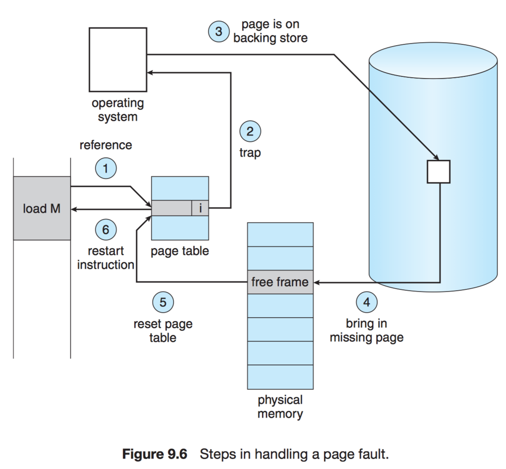
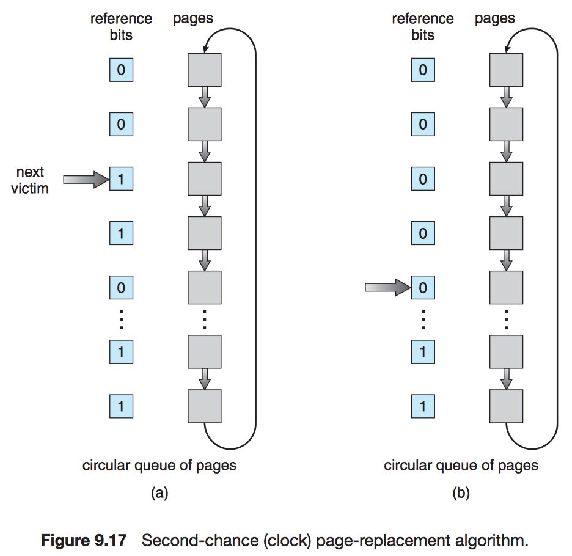

# Chapter 9 Virtual Memory

## 9.1 Background

> For instance, the routines on U.S. government computers that balance the budget have not been used in many years.

!!! note "Virtual memory"
    It separates the logical memory perceived by users from physical memory.

!!! note "Virtual address space"
    Logical (virtual) view of how a process is stored in memory.

!!! note "Sparse address spaces"
    Virtual address spaces that include holes.

## 9.2 Demand Paging

!!! note "Demand paging"
    A strategy to load pages only as they are needed.

!!! note "Lazy swapper"
    A lazy swapper never swaps a page into memory unless that page will be needed.

- swapper: entire processes
- **pager**: individual pages of a process

### 9.2.1 Basic Concepts

If the valid bit is set to "invalid", there are 2 possibilities:

- the page is invalid
- the page is valid but is currently on the dist.

!!! note "Pure demand paging"
    Never bring a page into memory until it is required.

!!! note "Secondary memory"
    This memory holds those pages that are not present in main memory.

### 9.2.2 Performance of Demand Paging

For most computer systems, the memory-access time, denoted $ma$, ranges from 10 to 200 nanoseconds.

Let $p$ be the probability of a page fault ($0 \le p \le 1$). We would expect $p$ to be close to zero.

$$\text{effective access time} = (1 - p) \times ma + p \times \text{page fault time}.$$

## 9.3 Copy-on-Write

Many operating systems provide a pool of free pages for such requests.

!!! note "Zero-fill-on-demand"
    Zero-fill-on-demand pages have been zeroed-out before being allocated, thus erasing the previous contents.

!!! note "`vfork()` (virtual memory fork)"
    It operates differently from `fork()` with copy-on-write. With `vfork()`, the parent process is suspended, and the child process uses the address space of the parent.

## 9.4 Page Replacement

### 9.4.1 Basic Page Replacement

1. Find the location of the desired page on the disk.
2. Find a free frame:

    a. If there is a free frame, use it.

    b. If there is no free frame, use a page-replacement algorithm to select a **victim frame**.

    c. Write the victim frame to the disk; change the page and frame tables accordingly.

3. Read the desired page into the newly freed frame; change the page and frame tables.
4. Continue the user process from where the page fault occurred.

!!! note "Modify bit (dirty bit)"
    The modify bit for a page is set by the hardware whenever any byte in the page is written into.

When we select a page for replacement.

- If the modify bit is set, we must write the page to the disk.
- If the modify bit is not set, we need not write the page to the disk.

We must solve two major problems to implement demand paging:

1. frame-allocation algorithm: decide how many frames to allocate to each process.
2. page-replacement algorithm: when page replacement is required.

!!! note "Reference string"
    The string of memory references.

### 9.4.2 FIFO Page Replacement

!!! note "Belady's anomaly"
    For some page-replacement algorithms, the page-fault rate may increase as the number of allocated frames increases.

### 9.4.3 Optimal Page Replacement

!!! note "Optimal page-replacement algorithm"
    Replace the page that will not be used for the longest period of time, which will never suffer from Belady's anomaly.

### 9.4.4 LRU Page Replacement

The LRU policy is often used as a page-replacement algorithm and is considered to be good. The major problem is ***how*** to implement LRU replacement.

- Counter
    - cons: overflow
- Stack

### 9.4.5 LRU-Approximation Page Replacement

#### 9.4.5.1 Additional-Reference-Bits Algorithm

The operating system shifts the reference bit for each page into the high-order bit of its 8-bit byte, shifting the other bits right by 1 bit and discarding the low-order bit.

These 8-bit shift registers contain the history of page use for the last eight time periods.

e.g. A page with a history register value of 11000100 has been used more recently than one with a value of 01110111.

#### 9.4.5.2 Second-Chance Algorithm

In the worst case, when all bits are set, the pointer cycles through the whole queue, giving each page a second chance. It clears all the reference bits before selecting the next page for replacement. ($\to$ FIFO)

#### 9.4.5.3 Enhanced Second-Chance Algorithm

ordered pair = (reference bit, modify bit)

1. (0, 0) neither recently used nor modified—best page to replace
2. (0, 1) not recently used but modified—not quite as good, because the page will need to be written out before replacement
3. (1, 0) recently used but clean—probably will be used again soon
4. (1, 1) recently used and modified—probably will be used again soon, and the page will be need to be written out to disk before it can be replaced

### 9.4.6 Counting-Based Page Replacement

- least frequently used (LFU)
- most frequently used (MFU)

### 9.4.7 Page-Buffering Algorithms

Systems keep a pool of free frames

1. The desired page is read into a free frame from the pool before the victime is written out.
2. When the victim is later written out, its frame is added to the free-frame pool.

There are two variations:

1. To maintain a list of modified pages.
    - Whenever the paging device is idle, a modified page is written to the dist and its modify bit is reset.
2. To keep a pool of free frames but to remember which page was in each frame.
    - No I/O is needed in this case $\to$ "Swapped-in" time is saved!

### 9.4.8 Applications and Page Replacement