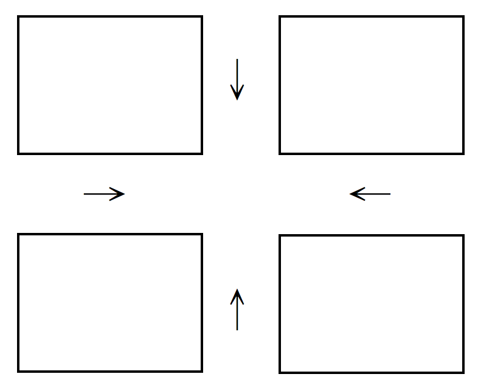

# Previous Operating System Midterms at NTUCSIE

## [Spring 2011](https://www.ptt.cc/man/NTU-Exam/DE0A/D36A/D55E/D109/M.1326244112.A.7FA.html)

1. Terminologies. (24pts)

    - **Security**

        <span style="color:red">Defense of a system from external and internal attacks, e.g., viruses, denial of services, etc.

    - **A Layered Approach in OS Designs**

        <span style="color:red">The operating system is broken into a number of layers (levels). The bottom layer (layer $0$) is the hardware; the highest (layer $N$) is the user interface.

    - **Para-virtualization**

        <span style="color:red">A variation on virtualization that presents a guest/operating system that is similar but not identical to the underlying hardware.

    - **Lightweight Process**

        <span style="color:red">A virtual processor (kernel threads) on which the application can schedule a user thread to run. (many-to-many or two-level)

    - **NUMA**

        <span style="color:red">Non-Uniform Memory Access: A CPU has faster access to some parts of main memory than to other parts.

    - **Deterministic Modeling**

        <span style="color:red">Take a particular predetermined workload and defines the performance of each algorithm for that workload.

    - **Race Condition**

        <span style="color:red">Several processes access and manipulate the same data concurrently and the outcome of the execution depends on the particular order in which the access takes place.

    - **Write Ahead Logging**

        <span style="color:red">All modifications are written to a log before they are applied.

2. Please answer following questions regarding the design of operation systems. (22pts)

    There are two conflicting goals in OS designs: Convenience and Efficiency.
    
    - Please give me one example feature of OS that shows the conflict in persuing efficiency and convenience (Hint: Live preview of open windows for Windows7 taskbar). (5pts)

        <span style="color:red">GUI vs Command Line.

    - What is the main goal of UNIX process init? Is init a user or kernel process? (8pts)

        <span style="color:red">init is responsible for bringing up a UNIX system after the kernel has been bootstrapped. **User process** with superuser privileges!

    - Please explain how I/O protection is done. (5pts)

        <span style="color:red">Dual Mode Operations: a mode bit.

    - Give me one advantage in OS implementations in some high-level language. (4pts)

        - <span style="color:red">Being easy to understand & debug.
        - <span style="color:red">Being written fast, more compact, and portable.

3. Please answer the following questions for process managment. (16pts)
    
    - Inside the Process Control Block, we might have a filed "Program Counter". What is the purpose of the field? (4pts)

        <span style="color:red">It can let us know which line to run, e.g. saved return address $\to$ program counter.

    - There are a lot of segments for a process image, such as code segment, data segment, heap, and user stack. When we call `malloc()` or `free()`, which segment is involved? (4pts)

        <span style="color:red">heap.

    - When a parent process calls `fork()` to create a child process, how does the parent process know the process ID of the created child process? (4pts)

        <span style="color:red">When a parent process invoke fork(), a duplication of the parent process is created for the resulted child process, where the parent process returns from fork() with the process ID of the created child process. The child process returns 0.

    - Which of the following IPC mechanisms does not require two communicating processes to have a parent-child relationship: Named Pipes and sockets. (4pts)

        <span style="color:red">Sockets.

4. Please answer the following questions for CPU scheduling. (17pts)

    - Compared to user-level threads, why the cost of context switching for kernel-level threads in higher? (4pts)

        - <span style="color:red">Kernel thread: involves switching registers, stack pointer, and program counter, but is independent of address space switching
        - <span style="color:red">User-level threads: similar context switching happens often.

    - The delivery of a signal for theads is complicated. Give me an example signal that should be delivered to the threads to which the signal applies. (4pts)

        <span style="color:red">Division by zero.

    - For preemptive scheduling, there are serveral occasions in triggering scheduling. Please give me three, beside the one in which a running process terminates by itself. (9pts)

        - <span style="color:red">A new process with a higher priority than the current process arrives.
        - <span style="color:red">An interrupt occurs. (fairness)
        - <span style="color:red">Periodically based on clock interrupt. (e.g. RR)

5. Consider Shortest-Job-First(SJF) and Round-Robin(RR) scheduling algorithms, and processes under considerations are only of one single CPU burst and are all ready at time $0$. Please answer the folowing questions. Explanation is needed to receive any credit: (18pts)

    - Is SJF always better than RR, for any time quantum, in terms of the average turnaround time?(6pts)

        <span style="color:red">Yes. ***Proof***:

        <span style="color:red">WLOG, given processes $P_1$, $P_2$, $\dots$, $P_n$ with CPU burst time $t_1$, $t_2$, $\dots$, $t_n$, where $t_1 < t_2 < \cdots < t_n$.
        
        <span style="color:red">By SJF, their turnaround time should be:

        <span style="color:red">
        $$
        \begin{array}{c|c}
        P_i & \text{waiting time} \\\\
        \hline
        P_1 & t_1 \\\\
        P_2 & t_1 + t_2 \\\\
        P_3 & t_1 + t_2 + t_3 \\\\
        \vdots & \vdots \\\\
        P_n & t_1 + t_2 + \cdots + t_n
        \end{array}
        $$
        
        <span style="color:red">Total waiting time:

        <span style="color:red">$$nt_1 + (n - 1)t_2 + \cdots + t_n.$$

        <span style="color:red">Obviously, this sum is minimized if $t_i$'s that are multiplied more times are smaller ones, i.e., 
            
        <span style="color:red">$$t_1 < t_2 < \cdots < t_n.$$

        <span style="color:red">Thus, in non-preemptive scheduling, SJF (actually Shortest-next-CPU-burst-first) is optimal for the purpose of minimizing turnaround time.

    - When all processes are of the same size, please tell us what the best time quantum is for RR in terms of the average waiting time. (6pts)

        <span style="color:red">$80\%$ of the CPU bursts should be shorter than the time quantum.

    - Now suppose that processes might arrive at different times, and SJF and RR are preemptive scheduling algorithms. Is SJF always better than RR, for any time quantum, in terms of the average waiting time. (6pts)

        <span style="color:red">Similar to 5.(a).

6. Please design a solution for airplanes to land in an airport. Suppose that there is only one runway in the airport. Please make sure that only one airplane can control the runway to land at a time, and there should be no starvation for your solution. (Hint: (1) the Bakery Algorithm; (2) Each process denotes an airplane.) (10pts)

    ```c
    int number[i];          // Pi's number if it is nonzeros
    boolean choosing[i];    // Pi is taking a number
    ```

    ```c
    do {
        choosing[i] = true;         // A process want to enter its critical section
        number[i] = max(number[0], ..., number[n - 1]) + 1;
        choosing[i] = false;        // A process has got its number
        for (int j = 0; j < n; j++) {
            while (choosing[j]) ;
            while (number[j] != 0 && (number[j], j) < (number[i], i)) ;     // If two processes got the same number, then we should compare their indices
        }
        /* critical section */

        number[i] = 0;
        /* remainder section */
    } while (true);
    ```

## [Fall 2011](https://www.ptt.cc/bbs/NTU-Exam/M.1335413893.A.32B.html)

The exam is 180 minutes long. The total score is 107pts. Please read the questions carefully.

1. Terminologies. (24pts)

    - **DMA**

        <span style="color:red">Release CPU from handling excessive interrupts!
        Execute the device driver to set up the registers of the DMA controller. DMA moves blocks of data between the memory and its own buffers. Transfer from its buffers to its devices. Interrupt the CPU when the job is done.

    - **Multiprogramming**

        <span style="color:red">Increases CPU utilization by organizing jobs so that the CPU always has one to execute.

    - **Horizontal Cache Coherency and Consistency**

        <span style="color:red">Among units of the same storage level.
        
        <span style="color:red">From [知乎](https://www.zhihu.com/question/25252397):

        - <span style="color:red">Coherence 保證的是同一地址有不同 copy 的時候，保證看到的是在 timing 上離自己最近的。
        - <span style="color:red">但是，只保證 Coherence 是不夠的，在 multiprocessor 不同地址的多個 copy 訪問的時候會出現問題，這個就是consistency

        - <span style="color:red">Coherence is concerned with updates/invalidations to a single shared variable.
        - <span style="color:red">Consistency is concerned with the behavior of memory references from multiple concurrent threads.

    - **A Module Approach in OS Designs** (Hint: A Layered Approach) [ask]

        <span style="color:red">Moving all nonessential components from the kernel to the user or system programs!

    - **Indirect Communication in Message Passing** ($\leftrightarrow$ Direct)

        - <span style="color:red">The messages are sent to and received from mailboxes, or ports.
        - ($\leftrightarrow$) The messages are sent to and received from processes.

    - **Socket**

        <span style="color:red">An endpoint for communication. (IP + port#)

    - **Deferred Cancellation** ($\leftrightarrow$ Asynchronous Cancellation)

        - <span style="color:red">The target thread periodically checks whether it should terminate, allowing it an opportunity to terminate itself in an orderly fashion.
        - ($\leftrightarrow$) One thread immediately terminates the target thread.

    - **Pull Migration** (Hint: Multipocessor Scheduling) ($\leftrightarrow$ Push Migration)

        - <span style="color:red">Pulling a waiting task from a busy processor.
        - ($\leftrightarrow$) Pushing processes from overloaded to less-busy processors.

2. Please answer the following questions regarding the designs of operating systems: (23pts)
    - Please give me two resources, beside CPU, that are managed by OS. (6pts)

        <span style="color:red">CPU time, Memory Space, File Storage, I/O Devices, Shared Code, Data Structures, and more.

    - When an interrupt arrives, a running task is interrupted, and its context could be saved in different ways, such as "a fixed address for all interrupts", "a fixed space for each interrupt type", and "a stack". What is the advantage in using a stack, compared with the approach in using a fixed space for each interrupt type? (5pts)

        <span style="color:red">If there are 2 interrupts, using fixed space is bad since the address of the first interrupted will be covered by later interrupted process.

    - In a memory hierarchy, we have registers, cache, memory, and disk. Which of them is managed by operating systems? Which of them is managed by hardware? (12pts)

        - <span style="color:red">Operating system: registers, cache, memory
        - <span style="color:red">Hardware: disk

3. OS services are such as those for "program execution", "file-system manipulation", "accounting", and "resource allocation". Which of them are for system efficiency, instead of user convenience? (8pts) [ask]

    <span style="color:red">Program execution and resource allocation.

4. Famous Application Programming Interfaces (API) are such as Win 32 API and POSIX API.
 
    - What are the two major benefits in providing API, compared to the providing of system calls only?

        - <span style="color:red">protability (expected to run on any system)
        - <span style="color:red">actual system calls can be more difficult to learn

    - What does POSIX API offers to programmers, compared to the offering of ANSI C to programmers? (8pts)

        - <span style="color:red">Any program written only in ANSI C and without any hardware dependent assumptions is virtully guaranteed to compile correctly on any platform with a conforming C implementation.
        - <span style="color:red">POSIX is an acronym for "Portable Operating System Interface". POSIX is for software compatibility with variants of UNIX and other operating systems.

5. In the ordinary virtualization design, the virtualization layer runs in the system mode.

    - For VMware, the virtualization layer runs in the system or user mode?

        <span style="color:red">The user mode.

    - For Java, the Java virtual machine run in the system or user mode? (6pts)

        <span style="color:red">The user mode.

6. Please answer the following questions for process management and scheduling. (20pts)

    - Give me two conditions for a running process to relinquish the CPU to go back to the ready queue in preemptive CPU scheduling. (6pts) [Spring 2011 5.(c)]

        - <span style="color:red">A new process with a higher priority than the current process arrives.
        - <span style="color:red">An interrupt occurs. (fairness)
        - <span style="color:red">Periodically based on clock interrupt. (e.g. RR)

    - Why a long-term scheduler has more time to choose a process for a system than a short-term scheduler does in process scheduling? (5pts)

        <span style="color:red">Because the interval between executions are longer.

    - Please explain the main difference between a user-level thread and a kernel thread. (5pts)

        <span style="color:red">

    - Is a Java thread is a user-level thread or a kernel thread? (4pts)

        <span style="color:red">Level Depending on the Thread Library on the Host System.

7. The scheduling algorithm of Solaris 9 is based on the Multilevel Feedback Queue Scheduling algorithm. There are six priority classes. Please explain the Fair Sharing class? Please explain how interactive threads in the Time Sharing or Interactive class are favored in scheduling in Solaris 8 or 9? (6pts)

    <span style="color:red">

8. Consider the scheduling of processes in which processes might arrive at different times and have different deadlines to complete their execution. Let the processes be scheduled by the preemptive Shortest-Job-First algorithm (PSJF) and a Priority Scheduling algorithm (PS) in which processes with urgent deadlines have higher priorities, and there is only one processor. Can you give a set of processes such that PS can meet the deadlines of the processes, but PSJF can not do it? (5pts)

    <span style="color:red">Given processes:

    | Process |   Period   |  ProcTime  |
    | :-----: | :--------: | :--------: |
    |  $P_1$  | $p_1 = 50$ | $t_1 = 25$ |
    |  $P_2$  | $p_2 = 80$ | $t_2 = 35$ |

    

    

9. Consider the Round Robin scheduling algorithm (RR) with two different time quantums $L$ and $S$, where $L > S$. Let the scheduling criteria be the average waiting time, and $L$ be larger than the largest CPU burst of all processes. Does RR, in general, favor a small time quantum $S$ when all processes are ready at time $0$? Please give me your answer with argument. (7pts)

    <span style="color:red">No. For example, given processes $P_1$, $P_2$ and $P_3$ with CPU burst time $10$, $10$ and $10$

    - <span style="color:red">With quantum $> 10 (L)$, average waiting time = (0 + (10 - 0) + (20 - 0)) / 3 = 30 / 10 = 10.
    - <span style="color:red">With quantum $= 5$, average waiting time = [0 + (15 - 5) + (5 - 0) + (20 - 10) + (10 - 0) + (25 - 15)] = 45 / 3 = 15.
    - <span style="color:red">With quantum $= 1$, average waiting time = ... = (18 + 19 + 20) / 3 = 19.
    - <span style="color:red">With quantum $\to 0$, average waiting time $\approx$ (20 + 20 + 20) / 3 = 20.

    <span style="color:red">It is obvious that smaller time slice will lead a longer average waiting time.

## [Fall 2012](https://www.ptt.cc/bbs/NTU-Exam/M.1418537836.A.BB5.html)

The exam is 180 minutes long. The total score is 110pts. Please read the questions carefully.

1. Terminologies. (24pts)

    - **Hardware Interrupt**

        <span style="color:red">Services requests of I/O devices.

    - **Virtual Machine**

        <span style="color:red">Provides an interface that is identical to the underlying bare hardware.

    - **Context Switch**

        <span style="color:red">It saves the state of the currently running process and loads the state of the newly scheduled process.

    - **A Full Duplex Pipe**

        <span style="color:red">A pipe that supports two ways of message passing simultaneously.

    - **Multilevel Queue Scheduling**

        <span style="color:red">Processes can be classified into different groups and permanently assigned to one queue, where there are Inter-queue and intra-queue scheduling policies.

    - **Memory Stall**

        <span style="color:red">A phenomenon in which a processor waits for a significant amount of time waiting for the data to become available.

    - **Bounded Waiting** (A Requirement of a Critical Section Solution)

        <span style="color:red">A waiting process only waits for a bounded number of processes to enter their critical sections.

    - **Adaptive Mutex**

        <span style="color:red">A binary semaphore in which it is a spinlock if the lock-holding thread is running; otherwise, blocking is used.
 
2. Please answer the following questions regarding the designs of operating systems: (20pts)

    - What is the difference between **multiprogramming** and **time sharing**? (6pts)

        <span style="color:red">Time sharing (or multitasking) is a logical extension of multiprogramming, where CPU services each of ready tasks in a way that every task receives CPU time in an interactive fashion.

    - Which one of the following memory unit is managed by the operating systems: Registers, Cache, Main Memory, Disks (8pts)

        <span style="color:red">Main Memory and Disks.

    - Operating systems services include user interfaces. UNIX shells, including the Bourne shell and C shell, provide command interpreters. Consider UNIX shells, please give me one command that is implemented as some code inside the command interpreter and two commands that are implemented by system programs? (6pts)

        - Inside the command interpreter:
            - C shell: <span style="color:red">umask, cd and limit
            - Bourne shell: <span style="color:red">ulimit -H and -S

        - By system programs: <span style="color:red">rm and ls

3. Message passing is a way for interprocess communication. Consider the capacity of a link between two processes has zero capacity. Is the message passing (between the two processes) synchronous or asynchronous? You must provide explanation to receive any credits. (5pts)

    <span style="color:red">It is synchronous because we can only have blocking sends and blocking receives.

4. 
    - Please give me one occasion when a mid-term scheduler should run.

        <span style="color:red">The remaining main memory is low or the CPU utilization is too high.

    - Can a short-term scheduler schedule the executions of user-level threads?

        <span style="color:red">No.

    - Can a short-term scheduler schedule the executions of a Java thread? (9pts)

        <span style="color:red">It depends on the thread library on the host system.

1. Consider signal handling for threads.

    - Is a Division-By-Zero signal synchronous or asynchronous?

        <span style="color:red">Synchronous.

    - Should a Division-By-Zero signal be delivered to every thread of its belonging process? (6pts) [Spring 2011 4.(b)]

        <span style="color:red">No. It should be only sent to the thread that causes the signal.

6. Please answer the following questions for process scheduling. Explanation is needed to receive any credit. (24pts)

    - For the Round-Robin Scheduling, what would be the preferred time slice in general? (4pts) [Spring 2011 6.(b)]

        <span style="color:red">$80\%$ of the CPU bursts should be shorter than the time quantum.

    - For the Round-Robin Scheduling, shall we have a small time slice for a better average turn around time? (4pts)

        <span style="color:red">No, a small time slice will increase the average turnaround time.

    - For the Priority Scheduling, how to avoid the starvation problem (in which a low priority process can never be scheduled)? (4pts)

        <span style="color:red">An **aging** solution by increasing the priority of a process that waits for a long time.

    - Please explain how a guest operating-system scheduling algorithm that assumes a certain amount of progress in a given amount of time might be negatively impacted by virtualization. (6pts)

        <span style="color:red">It is because the virtualization software needs to schedule the use of the physical CPUs among the virtual CPUs. A given amount of the time slice might take much more than the time of the virtual CPU time.

    - For the evaluation of a scheduling algorithm, please give me two difficulties in using the implementation method. (6pts)

        - <span style="color:red">Cost in modifying the OS
        - <span style="color:red">User reaction to OS changes
        - <span style="color:red">Changing of the environment in which the algorithm is used

7. Please explain the difference between the signal operation of a binary semaphore and that of a condition variable (of a monitor). (5pts)

    <span style="color:red">The signal operation of a condition variable resumes one suspended process. If there is none, no effect is imposed.

8. Consider a barber shop in which there are two barbers. Each barber can service exactly one customer at a time. Please use binary semaphores to implement the request for the hair-cut service. (12pts)

    <span style="color:red">Use an integer $S$ with initial value = $2$ to indicate the number of available barbers.

    ```c
    typedef struct {
        int value;
        struct customer *waiting_list;
    } semaphore;
    ```

    ```c
    wait(semaphore *S) {
        S->value--;
        if (S->value < 0) {
            add this customer to S->waiting_list;
            block();
        }
    }
    ```

    ```c
    signal(semaphore *S) {
        S->value++;
        if (S->value <= 0) {
            remove a customer C from S->waiting_list;
            wakeup(C);
        }
    }
    ```

    Customer $C_i$:

    ```c
    wait(S);
    /* critical section */
    signal(S);
    ```


9. Consider the time-stamp protocol of Chapter 6, in which each process $T_i$ is given a time stamp $T_S(T_i)$, and each read/write operation must check it up with the read and write timestamp of the accessed data object $Q$. Is it possible to have any deadlock? You must provide your explanation. (5pts) [ask]

    <span style="color:red">No deadlock because there is no hold-and-wait among processes.

## [Fall 2013](https://www.ptt.cc/bbs/NTU-Exam/M.1402216802.A.99D.html)

The exam is 180 minutes long. The total score is 103pts. Please read the questions carefully.

1. Terminologies. (24pts)

    - **Booting**

        <span style="color:red">Initialize all aspects of the system and then load and run the OS.

    - **Interrupt Vector**

        <span style="color:red">An array of interrupt-handlers' addresses that are indexed by device numbers (or interrupt numbers).

    - **Cache Coherency** [Fall 2011 1.(c)]

        <span style="color:red">Cache coherency problems can arise when more than one processors refer to the same data. Coherency defines what value is returned on a read.

    - **Platform as a service (PaaS) in Cloud Computing**

        <span style="color:red">Pass provides a computing platform and a solution stack as a service, such as a database server. One example is Microsoft Azure.

    - **A Modular Kernel** (Hint: OS Structure) [Fall 2011 1.(d)]

        <span style="color:red">A moduler kernel consists of a set of components, where there are core/primary modules, and it is of modules without a layer structure.

    - **Data Parellelism in Multicore Programming**

        <span style="color:red">Distribute data over cores to execute the **same operation**.

    - **Rate Monotonic Scheduling**

        <span style="color:red">A fixed priority real-time process scheduling algorithm in which the priorities of processes are **inversely proportional to their periods**.

    - **Deterministic Modeling** [Spring 2011 1.(f)]

        <span style="color:red">Take a particular predetermined workload and defines the performance of each algorithm for that workload.

2. Please answer the following questions regarding the designs of operating systems: (20pts)

    - There are two conflicting goals in the designs of operating systems. What is the other one, beside "convenient for the users" ? (3pts)

        <span style="color:red">Efficient operation of the computer system.
        
    - Which one of the following actions/events is belonging to or might result in software interrupts: System calls, child termination, mouse clicking, invalid memory access. (8pts)

        <span style="color:red">System calls, child temination, and invalid memory access.

    - Consider the implementation of virtual machines in which operating systems run on the top of the virtual machine software (or referred to as the hypervisor). Is an operating system running in the user mode or kernel mode? (3pts) [Fall 2011 5.(a), Fall 2013 2.(c)]

        <span style="color:red">The user mode.

    - Please give me 2 advantages of virtual machines, beside system consolidation and easy in system development/deployment. (6pts)

        <span style="color:red">Complete isolation and multiple personalities.
        
3. ANSI C refers to the family of successive standards published by ANSI for the C programming language. Please compare difference (or provide the purpose difference) between POSIX and ANSI C. (5pts) [Fall 2011 4.(b)]
       
    - <span style="color:red">Any program written only in ANSI C and without any hardware dependent assumptions is virtully guaranteed to compile correctly on any platform with a conforming C implementation.
    
    - <span style="color:red">POSIX is an acronym for "Portable Operating System Interface". POSIX is for software compatibility with variants of UNIX and other operating systems.

4. Please answer the following questions for task scheduling. (14pts)

    - Is the "Swapper" a short-term or mid-term scheduler? [ask]

        <span style="color:red">Short-term scheduler.

    - In UNIX, the process control block PCB[] of a process consists of proc[] and .u, where the attributes in .u are those needed when the process is running, and the attributes in proc[] are those needed all the time. Please indicate which one should be in .u : file[], task priority, pid, signal disposition, and task state. You must provide explanation to receive any credits. (10pts) [ask]

        - <span style="color:red">file[]: what files are "being" opened.
        - <span style="color:red">signal disposition: how to deal with signals.

5. Consider message passing and shared memory for inerprocess communication. Is "Pipe" considered one for message passing or shared memory ? Is "Pipe" direct or indirect communication ? Is it "synchronous" or "asynchronous"? for a reader or a writer of the communication in UNIX. You must provide explanation to receive any credits. (12pts)

    - <span style="color:red">Message passing. Since it's communication between processes without sharing the same address space.
    - <span style="color:red">Indirect communication. [ask]
    - <span style="color:red">Synchronous for a reader. [ask]
    - <span style="color:red">Asynchronous for a writer. [ask]

6. Kernel-level threads are superior than uer-level threads do in many ways.

    - What is the main disadvantage of kernel-level threads?

        <span style="color:red">It is context switching cost.

    - With OpenMP in program development, shall we prefer kernel-level or user-level threads? You must provide explanation to receive any credits. (8pts)

        <span style="color:red">We prefer kernel-level threads because we look for parallelism to better utilize multiple cores of a system.

7. Please answer the following questions for process scheduling. Explanation is needed to receive any credits. (15pts)

    - Given 3 processes $P_1$, $P_2$, and $P_3$ with CPU burst time $5$, $6$, $7$, respectively. Suppose that the 3 processes arrive at time $0$, and $P_1$ and $P_3$ are the first and the last processes in the ready queue, respectively. What is the average waiting time in running the 3 processes under the Round-Robin Scheduling with the time slice equal to $3$. (5pts)

        <span style="color:red"> (6 + (3 + 5) + (6 + 5)) / 3 = 25 / 3.

    - Consider FCFS and Round-Robin Scheduling. If process are only of CPU burst and all arrive at time $0$, do FCFS and Round-Robin Scheduling with time slice = $1$ always have the same total waiting time in running all processes ? Prove your answer. (5pts)

        <span style="color:red">No, for example, given processes of CPU burst 7, 1, and 1.

    - Suppose that the variance of the tunaround time is the cirterion in process scheduling. Shall we have a small time slice for a better variance turnaround time when all processes arrive at time $0$? (5pts)

        <span style="color:red">No. For example, given processes $P_1$, $P_2$ and $P_3$ with CPU burst time $10$, $10$ and $10$.

        - <span style="color:red">With quantum $= 10$, average turnaround time = (10 + 20 + 30) / 3 = 60 / 3 = 20.
        - <span style="color:red">With quantum $= 5$, average turnaround time = (20 + 25 + 30) / 3 = 75 / 3 = 25.
        - <span style="color:red">With quantum $= 1$, average turnaround time = ... = (28 + 29 + 30) / 3 = 87 / 3 = 29.
        - <span style="color:red">With quantum $\to 0$, average turnaround time $\approx$ 30 + 30 + 30 = 90 / 3 = 30.

        <span style="color:red">It is obvious that smaller time slice will lead a longer average turnaround time.

8. Please explain why the Completely Fair Scheduling (CFS) of Linux V2.6 favors I/O tasks. (5pts)
       
    <span style="color:red">CFS usually dispatches the CPU to the task with the smallest vruntime (that denotes how long the task runs) such that I/O tasks usually have smaller vruntime.

## [Fall 2014](https://www.ptt.cc/bbs/NTU-Exam/M.1434421485.A.9E4.html)

The exam is 180 minutes long. The total score is 108pts. Please read the questions carefully.

1. Terminologies. (24pts)
   
    - **Buffering** (Hint: It is not caching.)

        <span style="color:red">It means to keep data in a faster medium temporarily before moving them to a slower layer.

    - **Virtual Machine** [Fall 2012 1.(b)]

        <span style="color:red">Provides an interface that is identical to the underlying bare hardware.

    - **System Generation** (SYSGEN)

        <span style="color:red">The process to configure or generate an operating system for a one specific computer.

    - **Context Switch** [Fall 2012 1.(c)]

        <span style="color:red">Save the state of the old process and load the state of the newly scheduled process.

    - **Remote Procedure Call** (Hint: Message Passing)

        <span style="color:red">Senders are blocked until the receivers have received messages and replied by reply messages. (A way to abstract the procedure-call mechanism for use between systems with network connection.)

    - **Implicit Threading**

        <span style="color:red">Transfer the creation and management of the threading from the application developers to compilers and run-time libraries.

    - **Earliest Deadline First Scheduling**

        <span style="color:red">A dynamic-priority real-time process scheduling algorithm in which the priorities of processes are higher if their deadlines are closer.

    - **Race Condition** [Spring 2011 1.(g)]

        <span style="color:red">Several processes access and manipulate the same data concurrently and the outcome of the execution depends on the particular order in which the access takes place.

2. Please answer the following questions regarding the designs of operating systems: (22pts)
    - An operating system could be considered as a resource allocator. Please list 3 resources managed by an operating systems. (6pts) [Fall 2011 2.(a)]

        <span style="color:red">CPU time, Memory Space, File Storage, I/O Devices, Shared Code, Data Structures, and more.

    - Please explain what happens to the operating system when an interrupt arrives (until the interrupt is serviced). (4pts)

        <span style="color:red">Saving of the address of the interrupted instruction, determine the interrupt type (by polling or interrupt vector), call the corresponding handlers.

    - Which one of the following instructions is a privileged instruction:

        Reading of the Timer, setting of the base register of the memory space of a process, increment the value of a CPU register by one. No explanation is needed. (6pts)

        <span style="color:red">Setting of the base register of the memory space of a process.

    - Please explain what happens when a command-line user interface of UNIX executes a command. (6pts)

        <span style="color:red">Search the exec file which corresponds to the command; fork a process to execute the file.

3. Consider parameter passing to a system call. Give me the major advantage in having a register pointing to a memory block that stores all parameters, compared to having all parameters stored in registers? (5pts)

    <span style="color:red">The space needed to store all parameters is virtually unlimited.

4. The memory image of a UNIX process might consist of a code segment, a data segment, a heap area, a user stack, a kernel stack, an environment variable area, and .u. 

    - Which one of the above is used when `malloc()` is invoked? [Spring 2011 3.(b)]

        <span style="color:red">heap.

    -  When the kernel stack is used? (8pts) [ask]

        <span style="color:red">Procedure invocation in the system mode.

5. 
    - Please explain how `fork()` works when a parent process invoke `fork()`. [Spring 2011 3.(c)]

        <span style="color:red">When a parent process invoke fork(), a duplication of the parent process is created for the resulted child process, where the parent process returns from fork() with the process ID of the created child process. The child process returns 0.

    -  Please use the answer to the `fork()` invocation to explain the difference between `fork()` and `vfork()`. (10pts)

        <span style="color:red">When a parent process invoke vfork(), a child process is created by
       using the process image of the parent process, including its code and data segments. However, the parent process stop temporarily until the child process invokes an execve()-like system call to start a new program or terminates. The child process can modify any contents of the
       data segment of the parent process.

6. In the multi-core age, threading is encouraged. Please answer the following questions: (8pts)
    - For multiple cores, do we prefer kernel-level threads or user-level threads? Why? (3pts) [Fall 2013 6.(b)]

        <span style="color:red">We prefer kernel-level threads because we look for parallelism to better utilize multiple cores of a system.

    - There are also challenges in programming. Consider merge sorting, in which an unsorted list is divided into $N$ sublists, each containing $1$ element, and then we repeatedly merge sublists to produce new sorted sublists until there is only $1$ sublist remaining. This will be the sorted list. Please use the concept of task parallelism to execute the merge sort over $N$ cores. (5pts)

        <span style="color:red">Each core is given a sublist of one element. We then group 2 adjacent cores and let one of the cores merge the sublists of the two cores.

7. Please answer the following questions for process scheduling. Explanation is needed to receive any credit. (15pts)

    - Given 5 processes $P_1$, $P_2$, $P_3$, $P_4$, and $P_5$ with CPU burst time $6$, $5$, $2$, $10$, $5$, respectively. Suppose that the $P_1$, $P_2$, $P_3$, $P_4$, and $P_5$ arrive at time $0$, $3$, $4$, $2$, and $5$, respectively. What is the average waiting time in running the 5 processes under the Preemptive Shortest-Job-First Scheduling. (5pts)

        <span style="color:red">(0 + (8 - 3) + (6 - 4) + (18 - 2) + (13 - 5)) / 5 = 31 / 5.

    - Consider Shortest-Job-First Scheduling and Round-Robin Scheduling. Please prove that the total waiting time in running all processes under Shortest-Job-First Scheduling is always no larger than that of Round-Robin Scheduling with time slice equal to $1$ when all processes are ready at time $0$? (5pts) [Spring 2011 5.(a)]

        <span style="color:red">Yes. ***Proof***:

        <span style="color:red">WLOG, given processes $P_1$, $P_2$, $\dots$, $P_n$ with CPU burst time $t_1$, $t_2$, $\dots$, $t_n$, where $t_1 < t_2 < \cdots < t_n$.
        
        <span style="color:red">By SJF, their waiting time should be:

        <span style="color:red">
        $$
        \begin{array}{c|c}
        P_i & \text{waiting time} \\\\
        \hline
        P_1 & 0 \\\\
        P_2 & t_1 \\\\
        P_3 & t_1 + t_2 \\\\
        \vdots & \vdots \\\\
        P_n & t_1 + t_2 + \cdots + t_{n - 1}
        \end{array}
        $$

        <span style="color:red">Total waiting time:

        <span style="color:red">$$(n - 1)t_1 + (n - 2)t_2 + \cdots + t_{n - 1}.$$

        <span style="color:red">Obviously, this sum is minimized if $t_i$'s that are multiplied more times are smaller ones, i.e., 
            
        <span style="color:red">$$t_1 < t_2 < \cdots < t_{n - 1} < t_n.$$

        <span style="color:red">Thus, in non-preemptive scheduling, SJF (actually Shortest-next-CPU-burst-first) is optimal for the purpose of minimizing average waiting time.

    - Suppose that the variance of the waiting time is the criterion in process scheduling. Shall we have a small time slice for a better variance for Round-Robin Scheduling when all processes of the same CPU burst arrive at time $0$? (5pts) [Fall 2011 9., Fall 2013, 7.(c)]

        <span style="color:red">No. For example, given processes $P_1$, $P_2$ and $P_3$ with CPU burst time $10$, $10$ and $10$

        - <span style="color:red">With quantum $= 10$, average waiting time = (0 + (10 - 0) + (20 - 0)) / 3 = 30 / 10 = 10.
        - <span style="color:red">With quantum $= 5$, average waiting time = [0 + (15 - 5) + (5 - 0) + (20 - 10) + (10 - 0) + (25 - 15)] = 45 / 3 = 15.
        - <span style="color:red">With quantum $= 1$, average waiting time = ... = (18 + 19 + 20) / 3 = 19.
        - <span style="color:red">With quantum $\to 0$, average waiting time $\approx$ (20 + 20 + 20) / 3 = 20.

        <span style="color:red">It is obvious that smaller time slice will lead a longer average waiting time.

8. Please answer the following questions for process synchronization: (16pts)
   
    - Please compare the difference between a binary semaphore and a condition variable. (3pts) [Fall 2012 7.]

        <span style="color:red">The signal operation of a condition variable resumes one suspended process. If there is none, no effect is imposed.

    - Please use Monitor to implement Consumer and Producer with a bounded buffer. (10pts)

        ```c
        monitor ProducerConsumer {
            int counter = 0;
            condition empty;
            condition full;

            void producer() {
                if (counter == n)
                    wait(empty);
                    /* produce a slot */
                counter++;
                signal(full);
            }

            void consumer() {
                if (counter == 0)
                    wait(full);
                    /* consume a slot */
                counter--;
                signal(empty);
            }
        }
        ```

        - <span style="color:red">counter: number of filled slots
        - <span style="color:red">empty: buffer has at least one empty slot
        - <span style="color:red">full: buffer has at lesat one full slot
        
    - Please prove that your above solution satisfy the Progress requirement of the Critical Section Problem. (3pts)

        - <span style="color:red">Mutual exclusioin: monitor ensures that only one process can execute.
        - <span style="color:red">Progress requirement: by signal(full) to wake wait(full) and signal(empty) to wake wait(empty), the processes won't wait forever.
        - <span style="color:red">Bounded-waiting: they will both at most wait for 1 process (each other).

## [Fall 2015](https://www.ptt.cc/bbs/NTU-Exam/M.1466605487.A.7AD.html)

The Exam is 180 minutes long. The total score is 105pts. Please read the questions carefully.

1. Terminologies. (24pts)

    - **Software Interrupts**

        <span style="color:red">Caused by software execution, e.g. signals, invalid memory access, division by zero, system calls.

    - **Performance Tuning**

        <span style="color:red">A procedure that seeks to improve performance by removing bottlenecks.

    - **Mid-Term Scheduler** ($\leftrightarrow$ Long-Term Scheduler $\leftrightarrow$ Short-Term Scheduler)

        - <span style="color:red">Swap processes in and out to control the degree of multiprogramming.
        - ($\leftrightarrow$) Long-Term Scheduler:
            - Selects processes from this pool
            - Loads them into memory for execution
            - Controls the degree of multiprogramming (# processes). 
            - Selects a good process mix of I/O-bound and CPU-bound.
        - ($\leftrightarrow$) Short-Term Scheduler:
            - Selects from among the processes that are ready to execute
            - Allocates CPU to one of them

    - **FIFOs of UNIX**

        <span style="color:red">Named pipes.

    - **Asynchronous Signal** ($\leftrightarrow$ Synchronous Signal)

        - <span style="color:red">An asynchronous signal usually reports some asynchronous event outside the program, e.g., ^C or time expiration.
        - ($\leftrightarrow$) Delivered to the same process that performed the operation causing the signal. e.g., illegal memory access, division by 0.

    - **Push Migration** (Hint: Load Balancing) [Fall 2011 1.(h)] ($\leftrightarrow$ Pull Migration)

        - <span style="color:red">Pushing processes from overloaded to less-busy processors.
        - ($\leftrightarrow$) Pulling a waiting task from a busy processor.

    - **Coarse-Grained Multithreading of Hardware Threads** ($\leftrightarrow$ Fine-Grained (interleved))

        - <span style="color:red">A thread executes on a processor until a long-latency event such as a memory stall occurs.
        - ($\leftrightarrow$) Switches between threads at a much finer level of granularity

    - **Analytic Evaluation** [Spring 2011 1.(f), Fall 2013 1.(h)]

        <span style="color:red">Analytic evaluation uses the given algorithm and the system workload to produce a formula or number to evaluate the performance of the algorithm for that workload.

2. Please answer the following questions regarding operating systems: (20pts)
    - Please compare the difference between interrupt handling by a generic handler and interrupt vector in terms of the mechanism and the response performance. (6pts)

        <span style="color:red">A generic handler finds out the interupt type and invokes the corresponding procedure but the interrupt vector lets the corresponding procedure directly invoked though checking up of the interrupt vector; performance: interrupt vector is faster.

    - Please compare the difference between the terms "time sharing" and "multiprogramming". (4pts) [Fall 2012 2.(a)]

        <span style="color:red">Time sharing (or multitasking) is a logical extension of multiprogramming, where CPU services each of ready tasks in a way that every task receives CPU time in an interactive fashion.

    - One of the most challenging parts in the implementations of a virtual machine is to satisfy the assumption of a certain amount of progress in a given amount of time. Please explain the challenge. (6pts) [Fall 2012 6.(d)]

        <span style="color:red">It is because the virtualization software needs to schedule the use of the physical CPUs among the virtual CPUs. A given amount of the time slice might take much more than the time of the virtual CPU time.

    - Parameter passing is an important issue in the implementation of command interpreters. Please explain how a command interpreter of UNIX passes parameters to the running process of a command issued on the command interpreter. (4pts)

        <span style="color:red">It can be done by using one of the exec() system calls.

3. Consider process states: New, Ready, Running, Waiting, and Terminated. Please explain how a state makes a transition to another state, where there is only one processor. (12pts)

    

4. Message passing is one major way for interprocess communication.

    - What is the main difficulty in using symmetric addressing for direct communication?

        <span style="color:red">Process naming (or modularity).

    For indirect communication, small messages are sent from a sender to a receiver usually by message copying.
    
    - How to reduce system overheads in-sending large messages to a receiver? (8pts)

        <span style="color:red">Remapping of addressing space.

1. For multicore programming, there could be data parallelism or task parallelism. Please explain how to use data parallelism to find the largest integer of a given set of integers. (5pts) [Fall 2014 6.(b)]

    <span style="color:red">First split data over $N$ cores, and let each core find the largest integer of its given integers. Then let one core find the largest integers among the largest integers found on each core.

6. Please answer the following questions for process scheduling. Explanation is needed to receive any credit. (15pts)

    - Is the First-Come, First-Served Scheduling (FIFO) a non-preemptive or preemptive scheduling algorithm? Why? (4pts)

        <span style="color:red">It is non-preemptive because the running process will not volunteer to give up its CPU until it stops.

    - Given 4 processes $P_1$, $P_2$, $P_3$, and $P_4$ with CPU burst time $5$, $2$, $4$, and $6$, respectively. Suppose that the $P_1$, $P_2$, $P_3$, and $P_4$ all arrive at time $0$. What is the average waiting time in running the 4 processes under the Round-Robin Scheduling with the time slice equal to $3$? (5pts) [Fall 2013 7.(a)]

        <span style="color:red">(8 + 3 + (5 + 5) + (8 + 3)) / 4 = 32 / 4 = 8.

    - Longest-Job-First Scheduling always schedules the process of the longest CPU burst first. When all processes arrive at time $0$, does Longest-Job-First Scheduling have the largest average turnaround time? (6pts) [Fall 2013 7.(c)]

        <span style="color:red">Yes.

7. Consider the intersection of the following two roads, where cars can go from each of the four directions. There is a stop sign for each direction so that every car must stop at the intersection and wait for any car that arrives earlier at the intersection to leave first.

    - Please use semaphores to implement your solution with some pseudo code. (10pts) [Fall 2012 8.]

        <span style="color:red">Use an integer $S$ with initial value = $1$ to indicate the number of available car and a FIFO queue waiting list.

        ```c
        typedef struct {
            int value;
            struct car *waiting_list;
        } semaphore;
        ```

        ```c
        wait(semaphore *S) {
            S->value--;
            if (S->value < 0) {
                add this car to S->waiting_list;
                block();
            }
        }
        ```

        ```c
        signal(semaphore *S) {
            S->value++;
            if (S->value <= 0) {
                remove a car C from S->waiting_list;
                wakeup(C);
            }
        }
        ```

        Car $C_i$:

        ```c
        wait(S);
        /* critical section */
        signal(S);
        ```

    - Please prove that your above solution satisfy the three requirements of the Critical Section Problem. (6pts)

        - <span style="color:red">Mutual exclusioin: only a car can go across the intersection.
        - <span style="color:red">Progress requirement: by block() and wakeup(), the processes won't wait forever.
        - <span style="color:red">Bounded-waiting: at most wait for $n - 1$ cars.

    - Could you revise your solution so that an ambulance can always go first? (5pts)

        

        <span style="color:red">Let the ambulance has the highest priority in the waiting queue.

## Spring 2018

The exam is 180 minutes long. The total score is 112pts. Please read the questions carefully.

1. Terminologies. (24pts)

    - init (Hint: Booting; a UNIX process)

        <span style="color:red">A user process that initializes system processes, e.g., various daemons, login processes, after the kernel has been bootstrapped.

    - Dual-Mode Operations (Hint: Mode Bit)

        <span style="color:red">Privileged and user-mode instructions, where privileged instructions are machine instructions that may cause harm.

    - Memory Protection (Hint: Hardware Protection)

        <span style="color:red">Prevent a user program from modifying the code or data structures of either the OS or other users!

    - A Modular Kernel

        <span style="color:red">A set of core components with characteristics: layer-like — modules; microkernel-like — the primary module

    - Asymmetric Addressing for Direct Communication

        <span style="color:red">In Direct Communication, sender must specify the receiver ID, but the receiver does not need to specify the sender ID. For example, Send(P, msg), Receive(id, msg)

    - Remote Procedure Call (RPC)

        <span style="color:red">A way to abstract the procedure-call mechanism for use between systems with network connection.

    - FIFOS of UNIX

        <span style="color:red">Named pipes of UNIX. It is a file in the file system and created by mkfifo(). It offers Half Dulex and Byte-Oriented Transmissions.

    - Implicit Threading

        <span style="color:red">Transfer the creation and management of the threading from the application developers to compilers and run-time libraries.

2. For the implementation of the UNIX process control block PCB[]， we have proc[] and .u, which contain different attributes for different purposes (e.g., those must be known regardless of whether the process is running). Which one is in the kemel or user address space? Are they both in the kemel or user address space? Which one of proc[] and .u signal disposition resides? Where thread-specific data/thread local storage will reside (in the kemel or user address space)? (8pts)

    - kernel address space: proc[]; user-address space: .u
    - .u: signal disposition.
    - user address space.

3. Please answer the following questions regarding operating systems: (21pts)

    - When timing sharing appears as a feature for operating systems, please tell us two emerging features/subsystems, beside job synchronization. (6pts)

        <span style="color:red">one-line file systems, virtual memory, sophisticated CPU scheduling.

    - Virtual machine software provides an interface that is identical to the underlying bare hardware. I/O over a virtual machine could be slow or fast, depending on the implementations. Please give me a case in which I/O is fast, compared to I/O directly over physical devices. (5pts)

        <span style="color:red">I/O can be fast over a hard disk when the corresponding disk is implemented over DRAM by emulation.

    - There are operating system services, such as program executions, I/O operations, accounting, resource allocation, e汀or detection. Which one is belonging to those for user convenience? Which one is belonging to those for system efficiency? (1Opts)

        <span style="color:red">user convenience: program executions, I/O operations, error detection; system efficiency: accounting, resource allocation.

4. Multithreading is important for multi-core architectures. Please answer the following questions: (12pts)

    - Task parallelism is one typical parallelism type. Please give one example for task parallelism. (5pts)

        <span style="color:red">Run merge sorting over cores by partitioning data.

    - Please provide two challenges in multicore programming. (4pts)

        <span style="color:red">Identifying Tasks — Dividing Activities, Balance, Data Splitting, Data Dependency, Testing and Debugging.

    - Why the context switching cost of kernel-level threads is higher than that of user-level threads. (3pts)

        <span style="color:red">Context switching cost is a little bit higher because the kernel must do the switching.

5. Compare preemptive scheduling and non-preemptive scheduling. Please answer the following questions: (21 pts)

    - In what circumstance, non-preemptive scheduling wiU be be吐er than preemptive scheduling? (4pts)

        <span style="color:red">Non-preemptive scheduling could be better than preemptive scheduling when all jobs are ready together at time 0.

    - The selection of CPU scheduling algorithms should consider the scheduling criteria. If the high Thoughput is the criterion, which one is the best: Shortest job first, FIFO, and round-robin scheduling. You must provide answer to get credits. (6pts)

        <span style="color:red">shortest job first.

    - Priority scheduling is a framework for scheduling. Please design a priority assignment formula that gives a lower priority to a job when it runs more time. (5pts)

        <span style="color:red">priority = 1 / consumed-CPU-time.

    - For Round-Robin Scheduling, if the lower average Tumaround Time is the criterion, sha11 we prefer a lower time slice? Suppose that a11 jobs are ready at time O. You must provide answer to get credits. (6pts)

        <span style="color:red">a lower time slice is bad to the low average turnaround time.

6. Processor Affinity is somehow against push migration. Please explain why. (6pts)

    <span style="color:red">It is because of the cost in cache repopulation.

7. Please explain the progress assumption concerns for virtualization. (6pts)

    <span style="color:red">lt is assumed that a certain amount of progress should be observed for a system in a given amount oftime under virtualization.


8. Consider solutions to the Critical Section Problem. Please answer the following questions (14pts)

    - Consider a computing server to service jobs from three FIFO queues in a round robin way whenever there are jobs in any non-empty queues. Please use semaphores to implement your solution with some pseudo code. (6pts)

        <span style="color:red">We let the dispatcher of each job queue to wait a shared semaphore whenever it has a pending job. Let the semaphore have a FIFO queue.

    - What is the difference between a binary, semaphore and a condition variable? (3pts)

        <span style="color:red">A conditino variable has nothing happening to a signal request if no job is waiting for the variable.

    - The Monitor-based implementation of the Dining Philosopher problem in the textbook implements the idea of two-chop-stick-per-time solution. Will it have the starvation problem? You must provide explanation to receive credits. (5pts)

        <span style="color:red">Yes, the starvation problem happens to a philosopher whenever his two neighboring philosophers take turn in eating while he is waiting.
